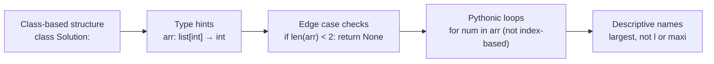
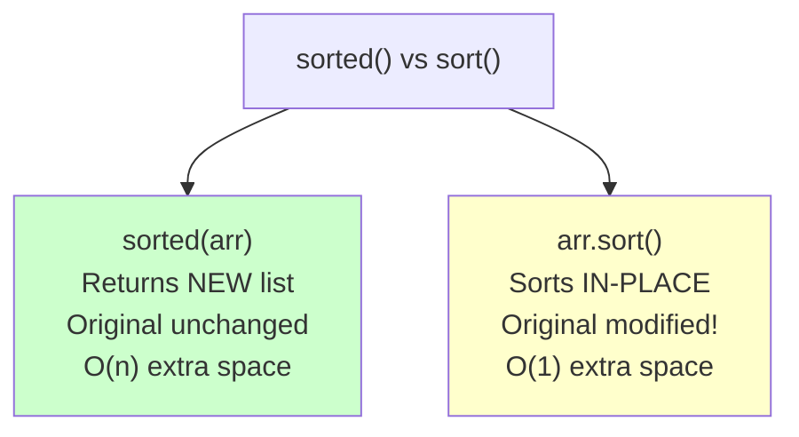
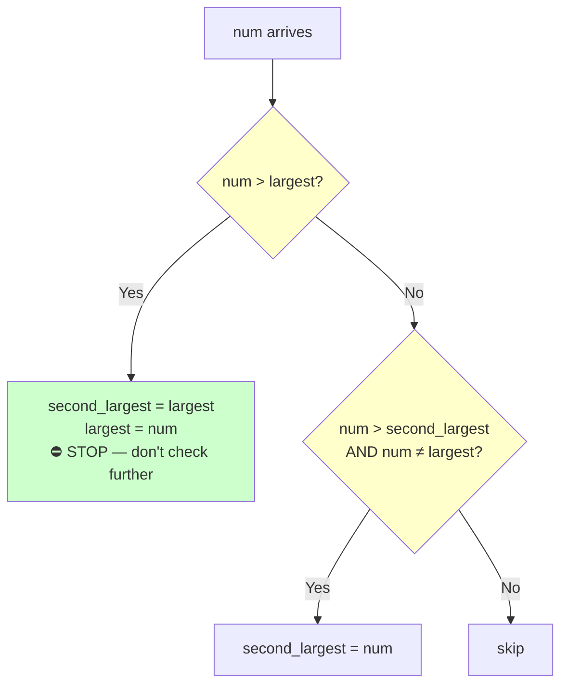
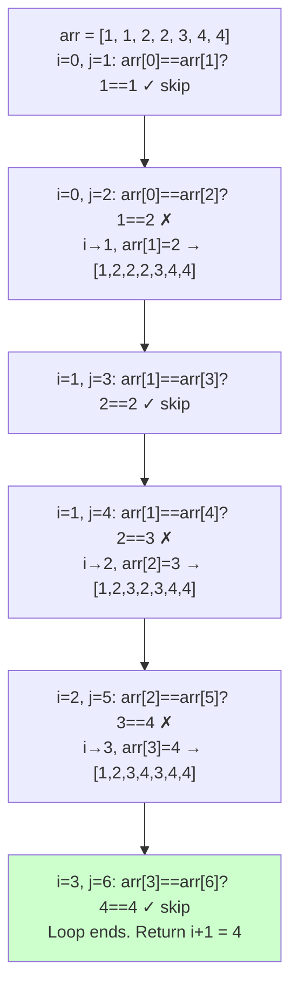

# Arrays — Easy Problems

> [!info] Pattern Focus
> Most easy array problems use: **Linear Scan**, **Two Pointers**, or **Hashing (Set/Dict)**

## Python List Methods — Complete Reference

### Modifying Methods (In-place)

| Method | What it does | Time | Example |
|--------|-------------|------|---------|
| `arr.append(x)` | Add `x` to end | O(1) | `[1,2].append(3)` → `[1,2,3]` |
| `arr.insert(i, x)` | Insert `x` at index `i` | O(n) | `[1,3].insert(1,2)` → `[1,2,3]` |
| `arr.extend(iterable)` | Add all items from iterable | O(k) | `[1].extend([2,3])` → `[1,2,3]` |
| `arr.pop()` | Remove & return last | O(1) | `[1,2,3].pop()` → returns `3` |
| `arr.pop(i)` | Remove & return at index `i` | O(n) | `[1,2,3].pop(0)` → returns `1` |
| `arr.remove(x)` | Remove first occurrence of `x` | O(n) | `[1,2,3,2].remove(2)` → `[1,3,2]` |
| `arr.sort()` | Sort in-place | O(n log n) | `[3,1,2].sort()` → `[1,2,3]` |
| `arr.reverse()` | Reverse in-place | O(n) | `[1,2,3].reverse()` → `[3,2,1]` |
| `arr.clear()` | Remove all elements | O(n) | `[1,2,3].clear()` → `[]` |

### Non-modifying Methods (Return value, original unchanged)

| Method | What it does | Time | Example |
|--------|-------------|------|---------|
| `len(arr)` | Length of array | O(1) | `len([1,2,3])` → `3` |
| `max(arr)` | Largest element | O(n) | `max([1,5,3])` → `5` |
| `min(arr)` | Smallest element | O(n) | `min([1,5,3])` → `1` |
| `sum(arr)` | Sum of all elements | O(n) | `sum([1,2,3])` → `6` |
| `sorted(arr)` | Returns NEW sorted list | O(n log n) | `sorted([3,1,2])` → `[1,2,3]` |
| `arr.index(x)` | Index of first `x` | O(n) | `[1,2,3].index(2)` → `1` |
| `arr.count(x)` | Count occurrences of `x` | O(n) | `[1,2,2,3].count(2)` → `2` |
| `arr.copy()` | Shallow copy | O(n) | `[1,2,3].copy()` → `[1,2,3]` |

### Slicing — `arr[start:stop:step]`

| Syntax | Result (for `[1,2,3,4,5]`) | Meaning |
|--------|---------------------------|---------|
| `arr[1:]` | `[2,3,4,5]` | From index 1 to end |
| `arr[:3]` | `[1,2,3]` | From start to index 3 (excluded) |
| `arr[1:4]` | `[2,3,4]` | From index 1 to 4 (excluded) |
| `arr[-1]` | `5` | Last element |
| `arr[-2:]` | `[4,5]` | Last 2 elements |
| `arr[::-1]` | `[5,4,3,2,1]` | Reversed |
| `arr[::2]` | `[1,3,5]` | Every 2nd element |

> [!warning] `arr[:] = ...` vs `arr = ...`
> - `arr[:] = [new stuff]` → modifies the **existing list object** in-place
> - `arr = [new stuff]` → creates a **new list**, old one unchanged if referenced elsewhere

### Deque (Double-Ended Queue) — `from collections import deque`

| Operation | List Time | Deque Time | Deque Method |
|-----------|-----------|------------|--------------|
| Add to end | O(1) | O(1) | `d.append(x)` |
| Add to front | O(n) | **O(1)** | `d.appendleft(x)` |
| Remove from end | O(1) | O(1) | `d.pop()` |
| Remove from front | O(n) | **O(1)** | `d.popleft()` |
| Rotate by k | O(n) manual | **O(k)** | `d.rotate(k)` |

> [!tip] `rotate(-k)` = left rotation, `rotate(k)` = right rotation

---

## Best Practices Followed



### Code Template (Use for Every Problem)

```python
class Solution:
    def brute(self, arr: list[int]) -> int:
        """One-line description"""
        # logic here

    def optimal(self, arr: list[int]) -> int:
        """One-line description"""
        # logic here

def main():
    arr = [...]
    sol = Solution()
    print(sol.brute(arr))
    print(sol.optimal(arr))

main()
```

---

## 001 — Largest Number in Array

### Problem Statement

Find the largest element in a given array.

### Approaches

| Approach | Method | Time | Space |
|----------|--------|------|-------|
| **Brute** | Sort, pick last element | O(n log n) | O(n) with `sorted()`, O(1) with `sort()` |
| **Optimal** | Single pass, track max | O(n) | O(1) |
| **Pythonic** | `max(arr)` | O(n) | O(1) |

```python
class Solution:
    def brute(self, arr: list[int]) -> int:
        return sorted(arr)[-1]

    def optimal(self, arr: list[int]) -> int:
        largest = float('-inf')
        for num in arr:
            if num > largest:
                largest = num
        return largest
```

### Key Concepts



> [!TIP] Why `float('-inf')` not `0`?
> If you initialise `largest = 0`, it **fails** for all-negative arrays like `[-5, -3, -1]`.
> `float('-inf')` is smaller than every possible number, so the first element always wins.

> [!summary]
> - `sorted(arr)[-1]` → brute, clean one-liner
> - `max(arr)` → Python built-in, does the same as optimal in O(n)
> - Always use `float('-inf')` for initialising a "find maximum" tracker

---

## 002 — Second Largest Number

### Problem Statement

Find the second largest element in an array. Return `None` if the array has fewer than 2 elements.

### Approaches

| Approach | Method | Time | Space |
|----------|--------|------|-------|
| **Brute** | Sort → traverse from end skipping duplicates of max | O(n log n) | O(1) |
| **Better** | Two passes — find max, then find second max | O(2n) → O(n) | O(1) |
| **Optimal** | Single pass — track both largest & second_largest | O(n) | O(1) |

```python
class Solution:
    def brute(self, arr: list[int]) -> int | None:
        if len(arr) < 2:
            return None
        second_largest = float('-inf')
        largest = max(arr)
        for num in arr:
            if num > second_largest and num != largest:
                second_largest = num
        return second_largest

    def optimal(self, arr: list[int]) -> int | None:
        if len(arr) < 2:
            return None
        largest = second_largest = float('-inf')
        for num in arr:
            if num > largest:
                second_largest = largest
                largest = num
            elif num > second_largest and num != largest:
                second_largest = num
        return second_largest
```

### The `elif` Lesson — Why Not Two `if` Statements?



With **two separate `if`** statements, both conditions run. After updating `largest`, the second `if` would also evaluate — logically wrong and fragile.

With **`if` / `elif`**, once the first branch matches, it **stops**. This is the correct flow.

> [!danger] Mistake Made & Fixed
> Originally used `if` + `if` instead of `if` + `elif`. The logic happened to not break with the test case but was **structurally wrong**. Always use `elif` when conditions are mutually exclusive.

### Chained Assignment

```python
largest = second_largest = float('-inf')  # ✅ Fine for immutable types (int, float, str)
a = b = []                                # ❌ DANGEROUS — both point to SAME list!
```

> [!summary]
> - Track two variables in a single pass for "second largest/smallest" problems
> - Use `elif` for mutually exclusive cascading conditions
> - `int | None` type hint for methods that can return None (Python 3.10+)
> - Edge case: always check `len(arr) < 2` before looking for second anything

---

## Mistakes & Learnings Log

| # | Mistake | Lesson |
|---|---------|--------|
| 1 | Used `l` as variable name | `l` looks like `1`. Use descriptive names: `largest`, `max_val` |
| 2 | Used `maxi = 0` to track max | Fails for all-negative arrays. Use `float('-inf')` |
| 3 | Used `if` + `if` instead of `if` + `elif` | Cascading exclusive conditions need `elif` to prevent both branches running |
| 4 | Mixed up brute/better naming | Brute = sort first O(n log n). Better = two passes O(2n). Optimal = one pass O(n) |
| 5 | Used `len` as variable name | Shadows Python's built-in `len()` function — causes `TypeError: 'int' is not callable` later |
| 6 | Returned `len(arr)` instead of `len_st` | Returned original array length, not the unique count |
| 7 | Used `% len(arr)` with `range(len(arr)-1)` | Modulo never wraps because `i+1` is always in bounds — dead code |

## Pythonic Tips Learned

| Verbose | Pythonic | Why |
|---------|----------|-----|
| `st = set()` + `for num: st.add(num)` | `st = set(arr)` | Pass iterable directly |
| `for i in range(len(arr)): arr[i]` | `for num in arr:` | Iterate elements directly |
| `for i in range(0, n, 1)` | `for i in range(n)` | 0 and 1 are defaults |
| `if len(arr) == 0:` | `if not arr:` | Empty collections are falsy |
| `len = s.brute(arr)` | `k = s.brute(arr)` | Never name variables after built-ins |

## Python Built-in Names to NEVER Use as Variables

`len`, `max`, `min`, `sum`, `list`, `set`, `dict`, `type`, `input`, `id`, `range`, `map`, `filter`, `sorted`, `print`

---

## 003 — Check If Array Is Sorted

### Problem Statement

Check if the given array is sorted in non-decreasing order.

### Approaches

| Approach | Method | Time | Space |
|----------|--------|------|-------|
| **Brute** | `sorted(arr) == arr` — sort a copy, compare | O(n log n) | O(n) |
| **Optimal** | Single pass — check every adjacent pair | O(n) | O(1) |

```python
class Solution:
    def brute(self, arr: list[int]) -> bool:
        return sorted(arr) == arr

    def optimal(self, arr: list[int]) -> bool:
        for i in range(len(arr) - 1):
            if arr[i] > arr[i + 1]:
                return False
        return True
```

> [!tip] Related Problem
> "Check if Array Is Sorted **and Rotated**" (LC 1752) needs `range(len(arr))` with `% len(arr)` and a `drop_count`. That's a different problem — don't mix them up.

> [!summary]
> - Simplest problem in the set. Interview answer is always the O(n) pass.
> - `sorted(arr) == arr` is a nice Pythonic one-liner but overkill at O(n log n).

---

## 004 — Remove Duplicates from Sorted Array

### Problem Statement

Given a **sorted** array, remove duplicates **in-place** and return the count of unique elements. The first `k` elements of the array should contain the unique values.

### Approaches

| Approach | Method | Time | Space |
|----------|--------|------|-------|
| **Brute** | Use `set()` to collect uniques, copy back | O(n) | O(n) |
| **Optimal** | Two pointers — `i` (last unique), `j` (scanner) | O(n) | O(1) |

```python
class Solution:
    def brute(self, arr: list[int]) -> int:
        st = set(arr)
        j = 0
        for x in sorted(st):
            arr[j] = x
            j += 1
        return len(st)

    def optimal(self, arr: list[int]) -> int:
        i = 0
        for j in range(1, len(arr)):
            if arr[i] != arr[j]:
                i += 1
                arr[i] = arr[j]
        return i + 1
```

### Two Pointer Dry Run



### Why `arr[i] = arr[j]`?

- `i` = "I'm building the unique section. Place the next unique HERE."
- `j` = "I'm scanning ahead for the next different element."
- When `arr[j] != arr[i]` → new unique found → advance `i`, place it there.
- After the loop, `arr[0..i]` contains all unique elements. Return `i+1`.

### Shadowing Built-ins

> [!danger] Never use these as variable names
> `len`, `max`, `min`, `sum`, `list`, `set`, `dict`, `type`, `input`, `id`, `range`, `sorted`, `print`
> 
> If you write `len = 5`, then `len([1,2,3])` will crash with `TypeError: 'int' is not callable`.

> [!summary]
> - **Two pointers on sorted data** is a fundamental pattern — appears in many problems.
> - `set()` is unordered! Use `sorted(set(arr))` if you need order.
> - `set(arr)` is Pythonic — no need for manual `for num: st.add(num)`.
> - This is your **first Two Pointer problem** — remember the slow/fast pointer concept.

---

## 005 — Rotate Array by One Place (Left)

### Problem Statement

Rotate the array left by one position. `[1,2,3,4,5]` → `[2,3,4,5,1]`

### Approaches

| Approach | Method | Time | Space |
|----------|--------|------|-------|
| **Brute** | Save first, copy to temp array, place first at end | O(n) | O(n) |
| **Optimal** | Save first, shift all left by 1, place first at end | O(n) | O(1) |
| **Pythonic** | `arr[:] = arr[1:] + [arr[0]]` | O(n) | O(n) |
| **Deque** | `deque(arr).rotate(-1)` | O(1) rotation | O(n) conversion |

```python
class Solution:
    def brute(self, arr: list[int]) -> None:
        temp_arr = []
        first_element = arr[0]
        for i in range(1, len(arr)):
            temp_arr.append(arr[i])
        for i in range(len(temp_arr)):
            arr[i] = temp_arr[i]
        arr[-1] = first_element

    def optimal(self, arr: list[int]) -> None:
        first_element = arr[0]
        for i in range(1, len(arr)):
            arr[i - 1] = arr[i]
        arr[-1] = first_element
```

### Key Insight

> [!tip] Both are O(n) time — the "optimal" is about SPACE (O(1) vs O(n)), not time.
> You MUST touch every element to rotate, so O(n) time is the lower bound.

### Pythonic One-liners

```python
# Slicing (O(n) space — creates new list)
arr[:] = arr[1:] + [arr[0]]

# Pop + Append (O(n) because pop(0) shifts everything)
arr.append(arr.pop(0))

# Deque (O(1) rotation if already a deque)
from collections import deque
d = deque(arr)
d.rotate(-1)  # negative = left, positive = right
```

> [!summary]
> - Rotation by 1 is O(n) minimum — can't avoid touching every element
> - Optimal = in-place shift, saving only 1 variable
> - `arr[:] = ...` modifies in-place, `arr = ...` creates new reference
> - `pop(0)` is O(n) on lists! Use `deque.popleft()` for O(1)

---

> [!note] This note will be updated as more easy array problems are covered.
