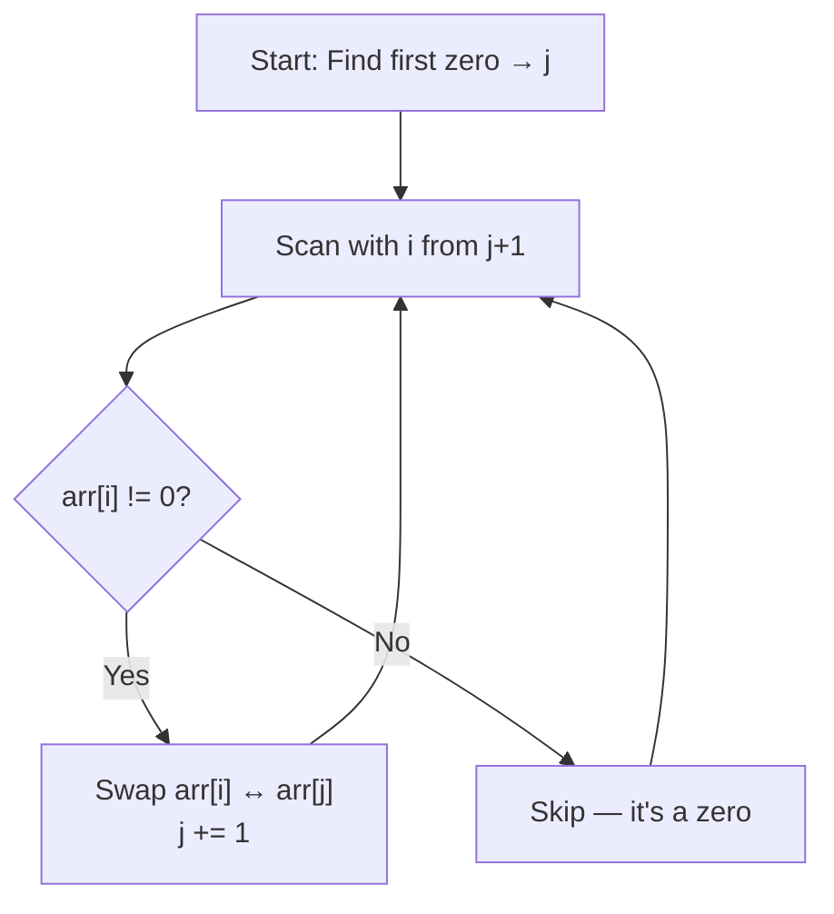

# 007 — Move Zeroes To End

> **Pattern:** Two Pointers / Partition Swap
> **Striver's Sheet:** Arrays Easy
> **Back to:** [[DSA Index]] → [[003_Arrays Easy]]

---

## Problem Statement

Move all zeroes in the array to the end while maintaining the relative order of non-zero elements. Do it **in-place**.

```
Input:  [1, 0, 2, 0, 3]
Output: [1, 2, 3, 0, 0]
```

---

## Approaches

| Approach | Method | Time | Space |
|----------|--------|------|-------|
| **Brute** | Collect non-zeroes in temp, pad zeros, copy back | O(n) | O(n) |
| **Optimal** | Two pointers — j = first zero, i = scanner, swap | O(n) | O(1) |

---

## Brute Force

Collect all non-zero elements into a temporary array, pad it with zeros, then copy everything back.

**Hardware analogy:** Like taking all books off a shelf into a box (temp array = extra RAM), removing the empty slots, then putting everything back. You're using **double the shelf space** temporarily.

```python
def brute(self, arr: list[int]) -> None:
    temp_arr = []
    for num in arr:
        if num != 0:
            temp_arr.append(num)
    addzero = len(arr) - len(temp_arr)
    temp_arr += [0] * addzero       # Pythonic: creates list of zeros and extends
    for i in range(len(arr)):
        arr[i] = temp_arr[i]
```

---

## Optimal — Two Pointer Swap

`j` always points to the **leftmost zero**. `i` scans forward. When `i` finds a non-zero, swap it into `j`'s position. Zeros naturally accumulate at the end.



```python
def optimal(self, arr: list[int]) -> None:
    j = -1
    for i in range(len(arr)):
        if arr[i] == 0:
            j = i
            break
    if j == -1:
        return
    for i in range(j + 1, len(arr)):
        if arr[i] != 0:
            arr[i], arr[j] = arr[j], arr[i]
            j += 1
```

---

## Dry Run

```
arr = [1, 0, 2, 0, 3]

Step 1: Find first zero → j = 1

Step 2: Scan from i = 2

i=2: arr[2]=2 ≠ 0 → swap(arr[1], arr[2]) → [1, 2, 0, 0, 3], j=2
i=3: arr[3]=0       → skip
i=4: arr[4]=3 ≠ 0 → swap(arr[2], arr[4]) → [1, 2, 3, 0, 0], j=3

Done! ✅ All zeros at end, order preserved.
```

---

## Real-Life Use Case

This pattern (in-place partitioning) appears in:
- **Quick Sort's partition step** — elements < pivot go left, ≥ pivot go right
- **OS Memory Compaction** — active memory blocks shift left, free space collects at the end (defragmentation)
- **Database filtering** — rearranging rows without allocating new tables

---

## Mistakes Made & Lessons

| # | Mistake | What Happened | Lesson |
|---|---------|--------------|--------|
| 1 | No `break` when finding first zero | Loop kept running, `j` ended up at the **last** zero instead of first | When searching for "first occurrence," always `break` immediately |
| 2 | `else: return arr` in the search loop | Function exited on the very first non-zero element — never even searched | The first loop's ONLY job is to find the first zero. Don't add `else` logic |
| 3 | Didn't increment `j` after swap | All non-zeroes kept swapping into the same position, breaking order | `j` must always track the leftmost zero — after a swap, the zero moves to `j+1` |
| 4 | Typo: `j == 01` instead of `j == -1` | `01` is an octal literal in Python (equals integer `1`), not `-1` | Watch for typos with negative signs. Python treats `0x`, `0o`, `0b` prefixes specially |

---

## Pythonic Tips from This Problem

| Verbose | Pythonic | Why |
|---------|----------|-----|
| `for i in range(n): temp.append(0)` | `temp += [0] * n` | List multiplication + extend in one line |
| `for i in range(len(arr)): if arr[i] != 0:` | `for num in arr: if num != 0:` | Iterate elements directly when you don't need the index |

---

## Key Takeaway

> [!tip] Two Pointer pattern for partitioning
> Whenever you need to **separate elements by a condition in-place** (zeros vs non-zeros, evens vs odds, negatives vs positives), use this exact pattern:
> 1. Find the first "unwanted" element → `j`
> 2. Scan with `i` from `j+1`
> 3. Swap "wanted" elements into `j`, advance `j`
>
> This is the foundation for **Quick Sort's partition** — learn it well.
