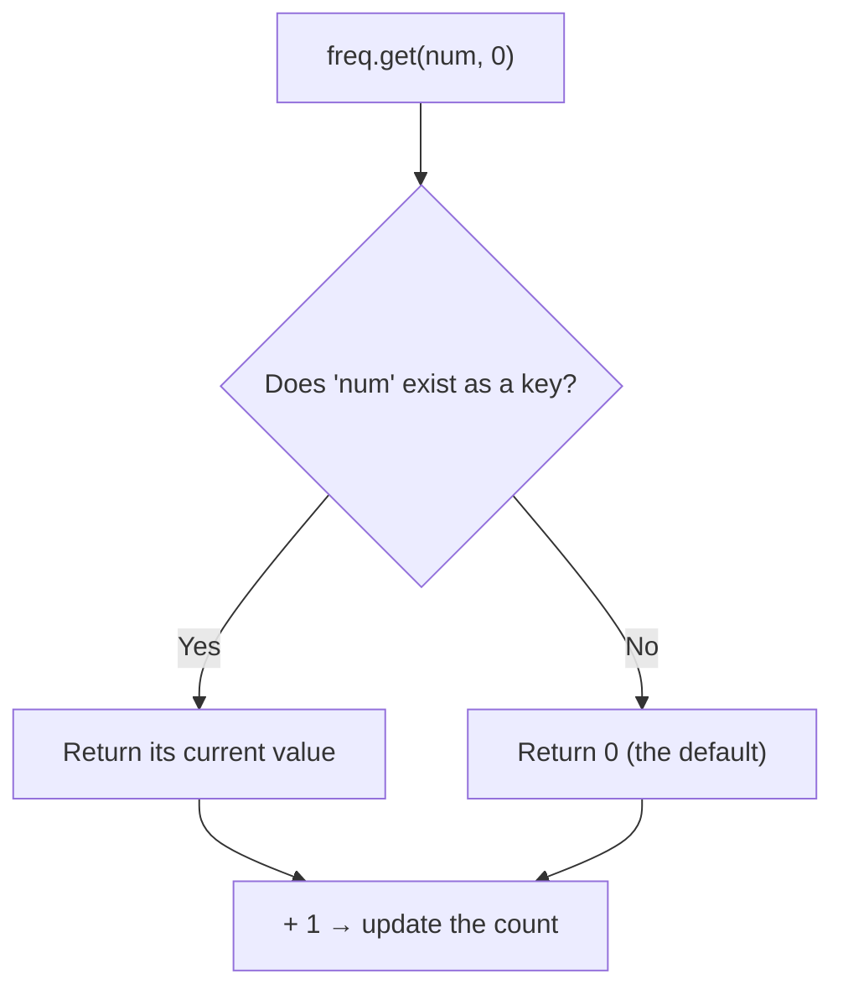
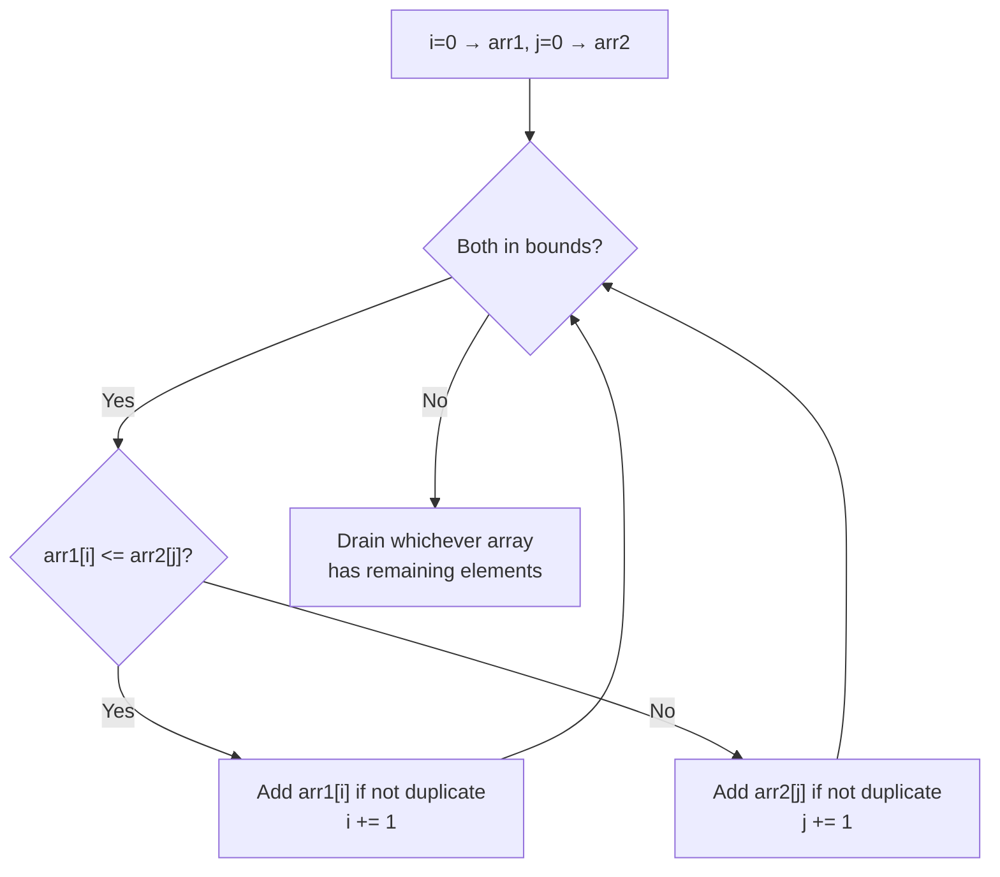
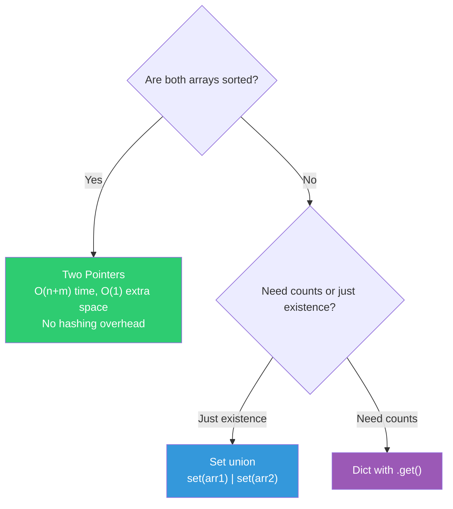

# 009 — Union of Two Arrays

> **Pattern:** Two Pointers (Merge) / Set / Dict
> **Striver's Sheet:** Arrays Easy
> **Back to:** [[DSA Index]] → [[003_Arrays Easy]]

---

## Problem Statement

Given two sorted arrays, return a new array containing all **unique elements** from both, in sorted order.

```
Input:  arr1 = [1, 2, 3, 4, 5, 6, 7], arr2 = [0, 1, 2, 3, 4, 8, 9]
Output: [0, 1, 2, 3, 4, 5, 6, 7, 8, 9]
```

---

## Approaches

| Approach | Method | Time | Space | Works on Unsorted? |
|----------|--------|------|-------|-------------------|
| **Brute** | `set(arr1) \| set(arr2)` | O(n+m) | O(n+m) | ✅ Yes |
| **Better** | Dictionary — count keys | O(n+m) | O(n+m) | ✅ Yes |
| **Optimal** | Two pointers merge | O(n+m) | O(n+m) for result | ❌ Sorted only |

---

## Brute — Set Union

```python
def brute(self, arr1: list[int], arr2: list[int]) -> list[int]:
    return sorted(set(arr1) | set(arr2))
```

> One-liner. `|` is the set union operator. `sorted()` returns it in order.

---

## Better — Dictionary

```python
def better(self, arr1: list[int], arr2: list[int]) -> list[int]:
    freq: dict[int, int] = {}
    for num in arr1:
        freq[num] = freq.get(num, 0) + 1
    for num in arr2:
        freq[num] = freq.get(num, 0) + 1
    return sorted(freq.keys())
```

### How `dict.get(key, default)` works



> Without `.get()`, accessing a missing key like `freq[num]` would raise `KeyError`. The `.get(key, default)` method is the safe alternative.

---

## Optimal — Two Pointer Merge (Sorted Arrays Only)

Walk two pointers simultaneously. Smaller element goes first. Skip duplicates by checking `union[-1]`.



### Dry Run

```
arr1 = [1, 2, 3, 5]    arr2 = [2, 4, 5, 6]
i=0, j=0

arr1[0]=1 <= arr2[0]=2 → union=[1],       i=1
arr1[1]=2 <= arr2[0]=2 → union=[1,2],     i=2
arr1[2]=3 >  arr2[0]=2 → 2==union[-1] skip, j=1
arr1[2]=3 <= arr2[1]=4 → union=[1,2,3],   i=3
arr1[3]=5 >  arr2[1]=4 → union=[1,2,3,4], j=2
arr1[3]=5 <= arr2[2]=5 → union=[1,2,3,4,5], i=4

arr1 exhausted → drain arr2:
arr2[3]=6 → union=[1,2,3,4,5,6]

Done! ✅
```

### Why `not union or union[-1] != x`?

This is the **duplicate skip** check:
- `not union` → if result is empty, always add (can't be a duplicate of nothing)
- `union[-1] != x` → if last added element is different, it's not a duplicate

> Since both arrays are **sorted**, duplicates are always **adjacent**. So checking only the last element is enough.

---

## Set vs Dict vs Two Pointers — When to Use What?



---

## Hardware Analogy

**Set/Dict (Hash Table):** Like a post office with numbered PO boxes. To check if box #42 has mail, you walk directly to box 42 — O(1). But setting up the PO boxes costs memory (O(n+m) space).

**Two Pointers:** Like two people reading sorted stacks of cards aloud. Each person reads their smallest unread card. The audience writes down each unique number they hear. No PO boxes needed — just two fingers tracking position.

---

## Mistakes Made & Lessons

| # | Mistake | Lesson |
|---|---------|--------|
| 1 | `st = set(arr1)` then `st = set(arr2)` — overwrote instead of union | `=` replaces. Use `\|` for set union or `set(arr1) \| set(arr2)` |
| 2 | Used unsorted arr2 with two-pointer approach | Two pointer merge **only works on sorted arrays**. Always sort first or use set/dict for unsorted |

---

## Pythonic Tips from This Problem

| Verbose | Pythonic | Why |
|---------|----------|-----|
| `if len(union) == 0` | `if not union` | Empty collections are falsy |
| `set(a)` then loop `set(b)` and add | `set(a) \| set(b)` | Set union operator does it in one shot |
| `for num in freq:` then `append(num)` | `list(freq.keys())` or `sorted(freq)` | Direct conversion |

---

## Python Set & Dict Quick Reference

### Set

```python
s = {1, 2, 3}           # literal
s = set([1, 2, 2, 3])   # from list → {1, 2, 3}
s.add(4)                 # add one element
s | other                # union
s & other                # intersection
s - other                # difference
x in s                   # O(1) lookup
```

### Dict

```python
d = {"a": 1, "b": 2}
d["c"] = 3               # add/update
d.get("x", 0)            # safe lookup with default
d.keys()                  # all keys
d.values()                # all values
d.items()                 # (key, value) pairs
del d["a"]                # remove key
```

---

## Key Takeaway

> [!tip] Two Pointer Merge = Merge Sort's merge step
> This exact pattern — walking two sorted arrays with two pointers — is the **merge step of Merge Sort**. Master it here, and Merge Sort becomes trivial.
