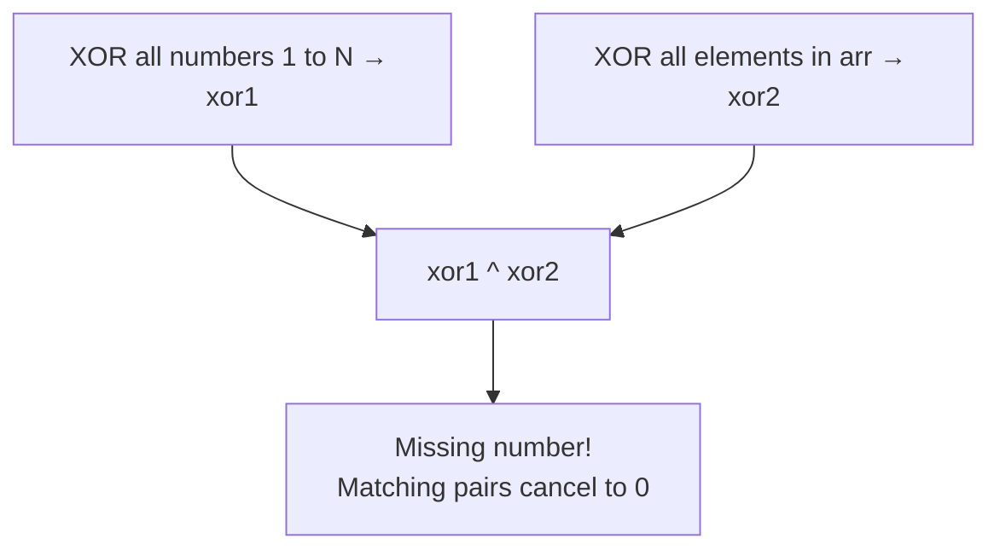
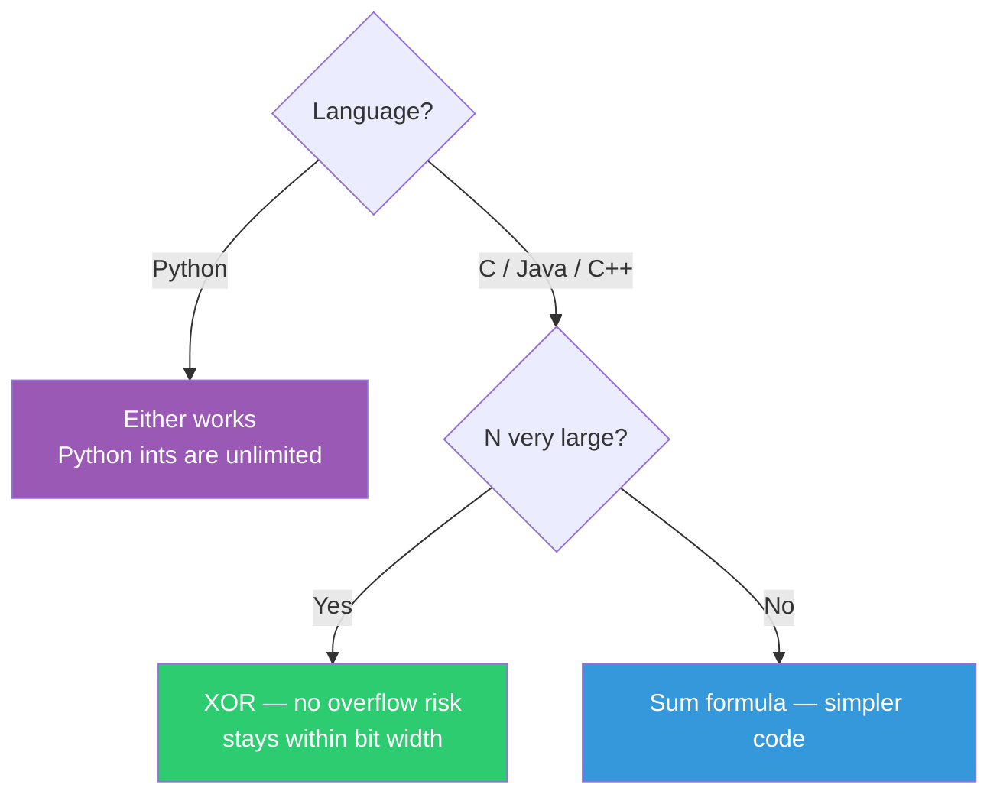

# 010 — Find The Missing Number

> **Pattern:** Math (Sum Formula) / XOR / Hashing
> **Striver's Sheet:** Arrays Easy
> **Back to:** [[DSA Index]] → [[003_Arrays Easy]]

---

## Problem Statement

Given an array of `n-1` distinct integers in the range `[1, N]`, find the one missing number.

```
Input:  arr = [1, 2, 3, 4, 5, 6, 7, 9, 10]
Output: 8
```

---

## Approaches

| Approach | Method | Time | Space |
|----------|--------|------|-------|
| **Brute** | Sort + check each number 1..N | O(n log n) + O(n²) | O(1) |
| **Better** | XOR all 1..N, XOR all arr, XOR both results | O(n) | O(1) |
| **Optimal** | Sum formula: N*(N+1)/2 - sum(arr) | O(n) | O(1) |

---

## Brute — Sort + Linear Search

```python
def brute(self, arr: list[int]) -> int:
    n = len(arr) + 1
    arr.sort()
    for i in range(1, n + 1):
        if i not in arr:
            return i
    return -1
```

> Sorting is O(n log n), then `i not in arr` is O(n) per check → O(n²) total. Overkill.

---

## Better — XOR Trick



### How XOR works

```
a ^ a = 0     (anything XOR itself = 0)
a ^ 0 = a     (anything XOR zero = itself)
```

### Dry Run

```
arr = [1, 2, 4, 5]  → missing 3, N = 5

xor1 = 1 ^ 2 ^ 3 ^ 4 ^ 5
xor2 = 1 ^ 2 ^ 4 ^ 5

xor1 ^ xor2 = (1^1) ^ (2^2) ^ 3 ^ (4^4) ^ (5^5)
             =  0   ^  0   ^ 3 ^  0    ^  0
             = 3 ✅
```

**Hardware analogy:** XOR is like a light switch — flip it twice (same number appears in both) = OFF (0). The one number flipped only once stays ON — that's your missing number. No overflow risk since XOR stays within bit width, unlike sum which can overflow in C/Java.

```python
def better(self, arr: list[int]) -> int:
    n = len(arr) + 1
    xor1 = 0
    for i in range(1, n + 1):
        xor1 ^= i
    xor2 = 0
    for num in arr:
        xor2 ^= num
    return xor1 ^ xor2
```

---

## Optimal — Sum Formula

Using the power of friendship... Nah, using meth... MATH*.

$$\text{missing} = \frac{N \times (N+1)}{2} - \sum(\text{arr})$$

```python
def optimal(self, arr: list[int]) -> int:
    n = len(arr) + 1
    total_sum = n * (n + 1) // 2
    arr_sum = sum(arr)
    return total_sum - arr_sum
```

> **Pythonic:** `sum(arr)` instead of manual `for num in arr: arr_sum += num`

---

## XOR vs Sum — When to Use What?



---

## Mistakes Made & Lessons

| # | Mistake | What Happened | Lesson |
|---|---------|--------------|--------|
| 1 | `n = len(arr)` instead of `len(arr) + 1` | XOR only covered 1 to 9, missing 10 from the range | Array has N-1 elements. Total range is N = len(arr) + 1. Always think about what N means |
| 2 | Used `&` (AND) instead of `^` (XOR) | AND checks bits common to both — wrong operation entirely | `^` = XOR (different bits), `&` = AND (common bits), `\|` = OR (any bit). Know your bitwise ops |
| 3 | `n = len(arr)` in brute + edge case checks | `arr[-1] != n` triggered incorrectly because n was wrong | Be consistent — if N means "total numbers including missing," use `len(arr) + 1` everywhere |
| 4 | `arr.sort()` mutating array before other methods used it | Brute sorted the array, then optimal/better got a sorted array instead of original | Sort on a copy (`sorted(arr)`) or use separate arrays for testing each method |

---

## Pythonic Tips from This Problem

| Verbose | Pythonic | Why |
|---------|----------|-----|
| `for num in arr: arr_sum += num` | `sum(arr)` | Built-in, C-optimized, one word |
| `total_sum = (n * (n+1)) / 2` | `n * (n + 1) // 2` | `//` = integer division, avoids float |

---

## Bitwise Operators Quick Reference

| Operator | Symbol | Example | Result |
|----------|--------|---------|--------|
| AND | `&` | `5 & 3` (101 & 011) | `1` (001) |
| OR | `\|` | `5 \| 3` (101 \| 011) | `7` (111) |
| XOR | `^` | `5 ^ 3` (101 ^ 011) | `6` (110) |
| NOT | `~` | `~5` | `-6` (inverts all bits) |
| Left Shift | `<<` | `5 << 1` | `10` (1010) |
| Right Shift | `>>` | `5 >> 1` | `2` (10) |

---

## Real-Life Use Case

- **Error detection in networking** — XOR checksums detect single-bit errors in transmitted data
- **RAID storage** — XOR of disk data enables recovery when one disk fails (parity disk)
- **Cryptography** — XOR is the foundation of many encryption algorithms (one-time pad)

---

## Key Takeaway

> [!tip] XOR for "find the unique/missing" problems
> Whenever a problem says "every element appears twice except one" or "find the missing number," XOR is your weapon. Pairs cancel to 0, the loner survives.
