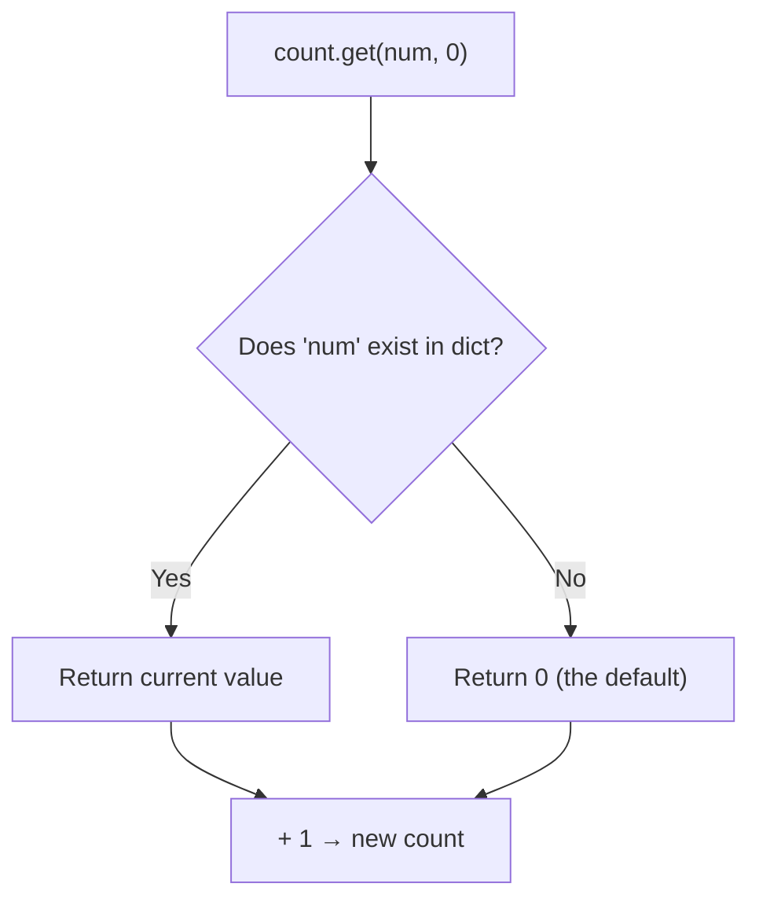
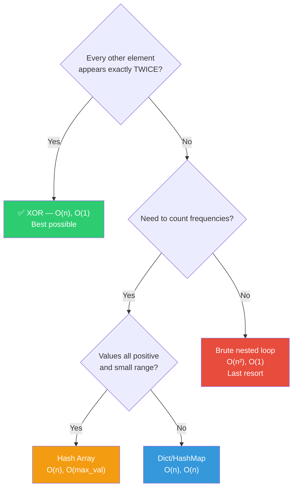

# 012 — Find The Number That Appears Once

> **Pattern:** XOR / Hashing (Frequency Count)
> **Striver's Sheet:** Arrays Easy
> **Back to:** [[DSA Index]] → [[003_Arrays Easy]]

---

## Problem Statement

Every element in the array appears **exactly twice**, except one. Find that single element.

```
Input:  [1, 1, 2, 3, 3, 4, 5, 6, 5, 4, 6]
Output: 2
```

---

## Approaches

| Approach | Method | Time | Space | Limitations |
|----------|--------|------|-------|-------------|
| **Brute** | Nested loop — count each element | O(n²) | O(1) | ⚠️ Way too slow for large arrays |
| **Better 1** | Hash Array — index-based counting | O(n) | O(max_val) | ⚠️ No negatives, wastes space if max is huge |
| **Better 2** | Dict/HashMap — key-value counting | O(n) | O(n) | ⚠️ Extra space used |
| **Optimal** | XOR all elements | O(n) | O(1) | ⚠️ Only works when others appear exactly TWICE |

---

## Brute — Nested Loop

For each element, count how many times it appears. Return the one with count == 1.

```python
def brute(self, arr: list[int]) -> int:
    n = len(arr)
    for i in range(n):
        cnt = 0
        num = arr[i]
        for j in range(n):
            if arr[j] == num:
                cnt += 1
        if cnt == 1:
            return num
    return -1
```

> [!warning] Limitation
> O(n²) — for 10⁵ elements, that's 10¹⁰ operations. Your CPU does ~10⁸-10⁹ ops/sec. This would take **10+ seconds**. TLE guaranteed on LeetCode.

---

## Better 1 — Hash Array

Create an array where **index = element, value = count**.

```python
def hash_array(self, arr: list[int]) -> int:
    max_val = max(arr)
    hash_arr = [0] * (max_val + 1)
    for num in arr:
        hash_arr[num] += 1
    for i in range(len(hash_arr)):
        if hash_arr[i] == 1:
            return i
    return -1
```

> [!warning] Limitations
> - ❌ **No negative numbers** — can't use -5 as an array index
> - ❌ **Space waste** — `arr = [1, 1, 999999]` allocates 1,000,000 slots for 3 elements
> - ✅ Use when: all values are small positive integers with known range

---

## Better 2 — Dictionary (HashMap)

The **most flexible** approach. Works with anything — negatives, large numbers, even strings.

```python
def hash_map(self, arr: list[int]) -> int:
    count: dict[int, int] = {}
    for num in arr:
        if num in count:       # key exists? increment
            count[num] += 1
        else:                  # new key? start at 1
            count[num] = 1
    for num in count:
        if count[num] == 1:
            return num
    return -1
```

### Three ways to write the counting loop

```python
# Way 1: if/else (what you wrote — explicit, interview-explainable)
if num in count:
    count[num] += 1
else:
    count[num] = 1

# Way 2: .get() (Pythonic shortcut — same thing, one line)
count[num] = count.get(num, 0) + 1

# Way 3: Counter (one-liner flex — uses collections module)
from collections import Counter
count = Counter(arr)
```

### How `.get(key, default)` works



### How to iterate a dict

```python
for key in count:                # iterate keys only
for key, value in count.items(): # iterate key-value pairs ← most useful
for value in count.values():     # iterate values only
```

> [!warning] Limitation
> O(n) extra space — stores up to n/2 + 1 unique keys in the dict.

---

## Optimal — XOR

```python
def optimal(self, arr: list[int]) -> int:
    xor = 0
    for num in arr:
        xor ^= num
    return xor
```

Pairs cancel: `a ^ a = 0`. The lone element survives.

> [!warning] Limitation
> Only works when every OTHER element appears **exactly twice**. If elements appear 3 times, or there are multiple singles, XOR alone won't work. (For 3 occurrences, you'd need modular arithmetic with bits.)

---

## When to Use What — Decision Tree



---

## Hardware Analogy

| Approach | Real-world analogy |
|----------|-------------------|
| **Brute** | Checking every student's name against every other student in a class. 30 students = 900 comparisons. |
| **Hash Array** | A row of lockers numbered 1-100. Drop a token in locker #X for each occurrence. Check which locker has 1 token. Wasteful if you only use lockers #1, #2, and #99999. |
| **Dict** | A notebook where you tally marks next to each unique name. Only uses space for names you've actually seen. |
| **XOR** | Noise-cancelling headphones. Identical sounds (pairs) cancel out. The unique sound (single element) is what you hear. |

---

## Pythonic Approaches (Interview Flex)

```python
# One-liner with Counter
from collections import Counter
return Counter(arr).most_common()[-1][0]   # least common element

# One-liner with XOR (using reduce)
from functools import reduce
return reduce(lambda a, b: a ^ b, arr)

# One-liner with operator
from functools import reduce
from operator import xor
return reduce(xor, arr)
```

> In an interview: write the explicit loop first (shows understanding), THEN mention the one-liner (shows Python knowledge).

---

## Mistakes & Learnings

| # | Learning | Why it matters |
|---|---------|----------------|
| 1 | Dict is the "go-to" for counting | Works with ANY data type, no range limitation |
| 2 | `.get(key, default)` prevents KeyError | Safer than raw `dict[key]` access |
| 3 | Hash array = positives only, dict = anything | Know which to pick based on constraints |
| 4 | XOR only works for "exactly two occurrences" | Don't blindly apply it to every frequency problem |

---

## Key Takeaway

> [!tip] The Frequency Counting Pattern
> Whenever a problem says "find elements that appear X times" or "count occurrences," your go-to is:
> 1. Build frequency map: `for num in arr: freq[num] = freq.get(num, 0) + 1`
> 2. Query it: `for key, val in freq.items(): if val == target: ...`
>
> This pattern appears in: Two Sum, Group Anagrams, Top K Frequent, Valid Anagram, and dozens more.
