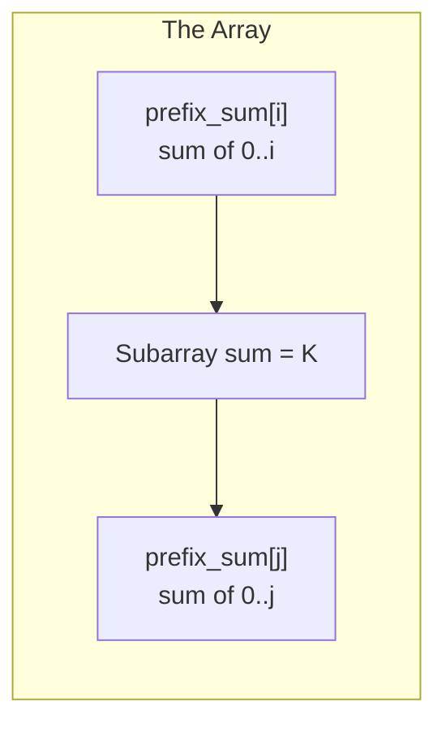
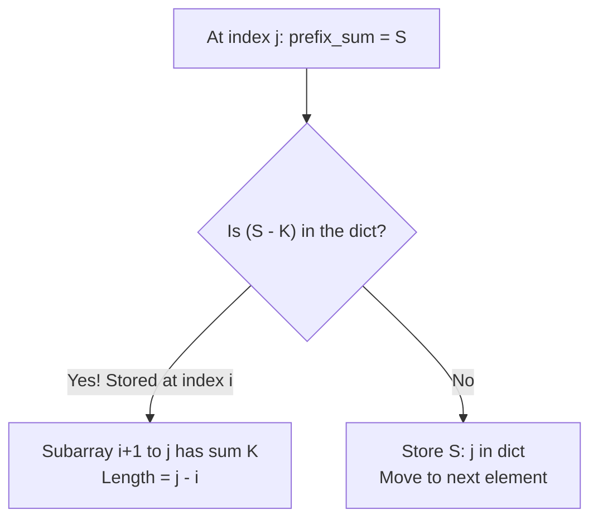
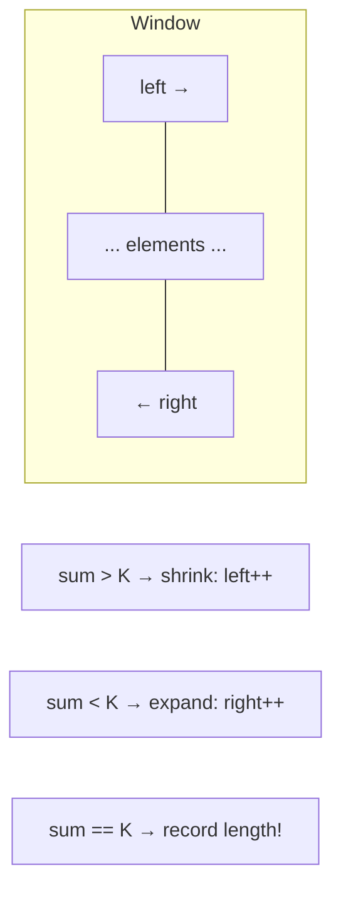
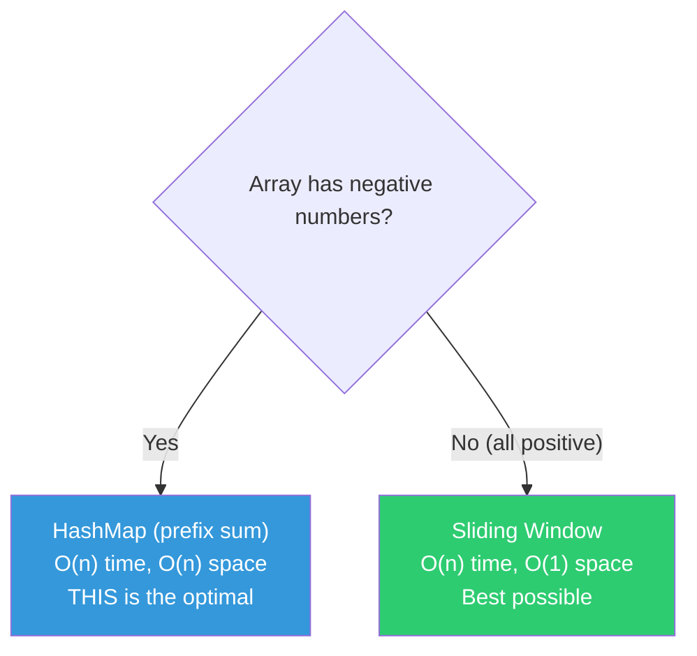

# 013 — Longest Subarray With Sum K

> **Pattern:** Prefix Sum + HashMap / Sliding Window
> **Striver's Sheet:** Arrays Easy (hardest one in the set)
> **Back to:** [[DSA Index]] → [[003_Arrays Easy]]
> **Status:** ⚠️ Needs revision — hashmap approach not fully understood yet.

---

## Problem Statement

Find the **longest contiguous subarray** whose elements sum to K.

```
Input:  arr = [2, 3, 5, 1, 9], K = 10
Output: 3 (subarray [2, 3, 5] has sum 10)
```

---

## What is a Subarray?

A **contiguous** chunk of the array. Elements must be side by side — no gaps.

```
arr = [1, 2, 3, 4, 5]

✅ Subarrays: [1], [1,2], [2,3,4], [3,4,5]
❌ NOT a subarray: [1,3,5] (has gaps)
```

> Don't confuse with **subsequence** (can skip elements) or **subset** (any combination).

---

## Approaches

| Approach | Method | Time | Space | Limitations |
|----------|--------|------|-------|-------------|
| **Brute** | Two loops, try all subarrays | O(n²) | O(1) | ⚠️ Slow for large arrays |
| **Better** | Prefix Sum + HashMap | O(n) | O(n) | ✅ Works with positives AND negatives |
| **Optimal** | Sliding Window (Two Pointers) | O(n) | O(1) | ⚠️ ONLY works with positive numbers |

---

## Brute — Try All Subarrays

```python
def brute(self, arr: list[int], k: int) -> int:
    n = len(arr)
    max_len = 0
    for i in range(n):           # start of subarray
        current_sum = 0
        for j in range(i, n):   # end of subarray
            current_sum += arr[j]
            if current_sum == k:
                max_len = max(max_len, j - i + 1)
    return max_len
```

> No third loop needed — accumulate sum as `j` moves forward.

---

## Better — Prefix Sum + HashMap

### The Big Idea

**Prefix sum** at index `i` = sum of all elements from index 0 to i.

```
arr =        [1, 2, 3, 1, 1, 1, 1]
prefix_sum = [1, 3, 6, 7, 8, 9, 10]
```

**The key insight:**

$$\text{prefix\_sum}[j] - \text{prefix\_sum}[i] = K \implies \text{subarray (i+1 to j) sums to K}$$



**Analogy — Odometer:** If your odometer reads 150 km at point A and 200 km at point B, you drove 200 - 150 = 50 km between A and B. You don't need to re-measure each road segment. Prefix sum works the same way.

### How the HashMap Helps

Instead of checking every pair (i, j), store prefix sums in a dict. For each new prefix_sum, ask:

> "Have I seen `prefix_sum - K` before?"



### Dry Run

```
arr = [1, 2, 3, 1, 1, 1, 1], K = 3
prefix_sum_map = {}

i=0: prefix_sum = 1
     1 - 3 = -2 in map? NO
     Store {1: 0}

i=1: prefix_sum = 3
     prefix_sum == K? YES! max_len = 1+1 = 2
     3 - 3 = 0 in map? NO
     Store {1: 0, 3: 1}

i=2: prefix_sum = 6
     6 - 3 = 3 in map? YES! at index 1
     Length = 2 - 1 = 1. max_len still 2.
     Store {1: 0, 3: 1, 6: 2}

i=3: prefix_sum = 7
     7 - 3 = 4 in map? NO
     Store {1: 0, 3: 1, 6: 2, 7: 3}

i=4: prefix_sum = 8
     8 - 3 = 5 in map? NO
     Store {..., 8: 4}

i=5: prefix_sum = 9
     9 - 3 = 6 in map? YES! at index 2
     Length = 5 - 2 = 3. max_len = 3 ✅

i=6: prefix_sum = 10
     10 - 3 = 7 in map? YES! at index 3
     Length = 6 - 3 = 3. max_len still 3.

Answer: 3
```

### Why NOT update the map if key exists?

We want the **longest** subarray. If prefix_sum was first seen at index 2 and again at index 5, we keep index 2 because `j - 2` gives a longer subarray than `j - 5`.

```python
def better(self, arr: list[int], k: int) -> int:
    prefix_sum_map: dict[int, int] = {}
    prefix_sum = 0
    max_len = 0
    for i in range(len(arr)):
        prefix_sum += arr[i]
        if prefix_sum == k:
            max_len = max(max_len, i + 1)
        remainder = prefix_sum - k
        if remainder in prefix_sum_map:
            length = i - prefix_sum_map[remainder]
            max_len = max(max_len, length)
        if prefix_sum not in prefix_sum_map:
            prefix_sum_map[prefix_sum] = i
    return max_len
```

---

## Optimal — Sliding Window (Positive Numbers Only)

Two pointers: `left` and `right` define a window. Expand right to grow, shrink left to reduce sum.



```python
def optimal(self, arr: list[int], k: int) -> int:
    left, right = 0, 0
    current_sum = arr[0]
    max_len = 0
    while right < len(arr):
        while left <= right and current_sum > k:
            current_sum -= arr[left]
            left += 1
        if current_sum == k:
            max_len = max(max_len, right - left + 1)
        right += 1
        if right < len(arr):
            current_sum += arr[right]
    return max_len
```

> [!danger] Limitation
> **Only works with positive numbers!** With negatives, adding more elements can decrease the sum, so the "shrink when too big" logic breaks. For arrays with negatives, the HashMap approach IS the optimal.

---

## Which Approach When?



---

## Real-Life Use Case

- **Network monitoring** — find the longest time window where data transfer equals a threshold
- **Budget tracking** — find the longest period of consecutive days where spending equals a target
- **DNA sequencing** — find the longest gene segment with a specific nucleotide sum

---

## Key Takeaways

> [!tip] Prefix Sum Pattern
> Whenever you see "subarray sum equals K" or "count subarrays with sum K," think:
> 1. **Prefix sum** — cumulative sum as you traverse
> 2. **HashMap** — store `{prefix_sum: index}` to find matching pairs in O(1)
> 3. Check `prefix_sum - K` in the map
>
> This pattern appears in: **Subarray Sum Equals K**, **Count Subarrays with XOR K**, **Contiguous Array (0s and 1s)**, and many medium/hard problems.

> [!warning] Revision needed
> Come back to this after revising all easy problems. The HashMap approach is a **must-know** — it's the foundation for many medium array problems.
