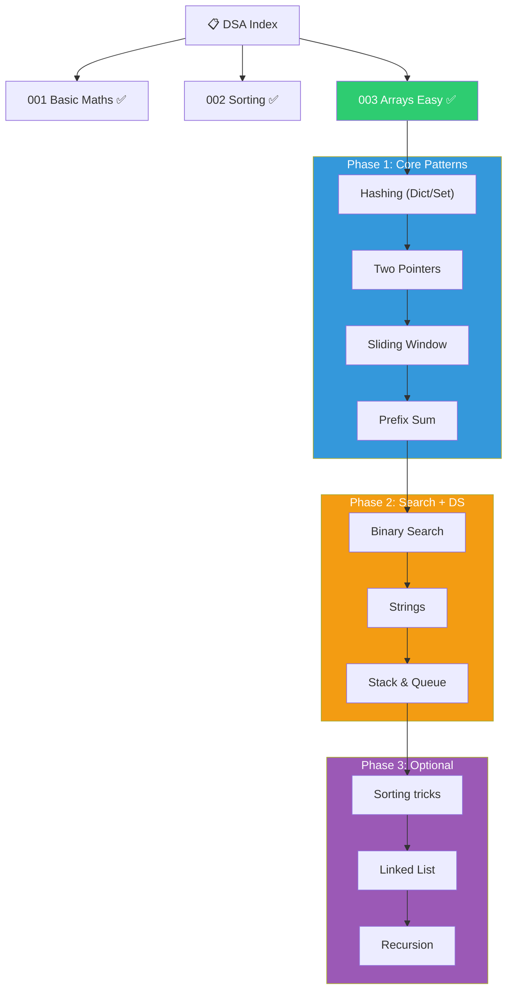

# DSA Practice — Master Index

> [!info] Structure
> Each topic links to a concept note. Each concept note links to individual problem breakdowns.
> Following **Striver's Sheet** — organized by concept, not difficulty.

> ❌ **Cut for SDET-1**: Trees, Graphs, DP, Backtracking, Heap — not asked in interviews.

---

## 📂 Topics

### Fundamentals (Done)
| # | Topic | Note | Status |
|---|-------|------|--------|
| 001 | Basic Maths | [[001_Basic_Maths]] | ✅ Done |
| 002 | Sorting Algorithms | [[002_Sorting Algorithms]] | ✅ Done |

### Arrays Easy (Done)
| # | Topic | Note | Status |
|---|-------|------|--------|
| 003 | Arrays — Easy | [[003_Arrays Easy]] | ✅ Done (13 problems) |

#### Individual Problem Notes — Arrays Easy
| # | Problem | Note | Pattern | Difficulty |
|---|---------|------|---------|------------|
| 001 | Largest Number in Array | Covered in [[003_Arrays Easy]] | Linear Scan | ⭐ |
| 002 | Second Largest Number | Covered in [[003_Arrays Easy]] | Linear Scan | ⭐ |
| 003 | Check If Array Sorted | Covered in [[003_Arrays Easy]] | Linear Scan | ⭐ |
| 004 | Remove Duplicates (Sorted) | Covered in [[003_Arrays Easy]] | Two Pointers | ⭐ |
| 005 | Rotate Array by One | Covered in [[003_Arrays Easy]] | Array Manipulation | ⭐ |
| 006 | Rotate Array by D Places | Covered in [[003_Arrays Easy]] | Reversal Trick | ⭐⭐ |
| 007 | Move Zeroes to End | [[007 Move Zeroes To End]] | Two Pointers / Partition | ⭐ |
| 008 | Linear Search | [[008 Linear Search]] | Linear Scan | ⭐ |
| 009 | Union of Arrays | [[009 Union of Two Arrays]] | Two Pointers / Set | ⭐⭐ |
| 010 | Find Missing Number | [[010 Find The Missing Number]] | Math / XOR | ⭐ |
| 011 | Max Consecutive Ones | — | Linear Scan | ⭐ |
| 012 | Number That Appears Once | [[012 Find The Number That Appears Once]] | XOR / Hashing | ⭐ |
| 013 | Longest Subarray Sum K | [[013 Longest Subarray With Sum K]] ⚠️ | Prefix Sum / Sliding Window | ⭐⭐ |

### Concept-Wise Progression (SDET-1 Focus)
| #   | Concept                         | Problems | Timeline | Status |
| --- | ------------------------------- | -------- | -------- | ------ |
| 1   | **Hashing** (Dict/Set counting) | 10       | Jul-Aug  | ⬜ Next |
| 2   | **Two Pointers**                | 8        | Aug      | ⬜      |
| 3   | **Sliding Window**              | 8        | Aug-Sep  | ⬜      |
| 4   | **Prefix Sum**                  | 5        | Sep      | ⬜      |
| 5   | **Binary Search**               | 8        | Sep-Oct  | ⬜      |
| 6   | **Strings** (redo in Python)    | 8        | Oct      | ⬜      |
| 7   | **Stack & Queue**               | 10       | Oct-Nov  | ⬜      |
| 8   | Sorting tricks                  | 5        | Nov      | ⬜      |
| 9   | Linked List (optional)          | 8        | Nov-Dec  | ⬜      |
| 10  | Recursion (optional)            | 8        | Dec      | ⬜      |

---

## 🧠 Global Mistakes & Learnings

> See individual problem notes for problem-specific mistakes.
> See [[003_Arrays Easy]] for cumulative mistakes log from problems 001–006.

## 🐍 Pythonic Tips Master List

> Accumulated across all problems. See [[003_Arrays Easy]] for tips from problems 001–006.
