# HashMap (Dictionary) — DSA Notes

## What is a HashMap?

A HashMap (Python: `dict`) is a data structure that stores **key-value pairs** with **O(1) average** lookup, insert, and delete.

**Real-world analogy**: Think of a phone book — you look up a NAME (key) and instantly get the PHONE NUMBER (value). You don't scan every page.

**Under the hood**: It uses a **hash function** to convert the key into an array index. That's why lookup is O(1) — it calculates WHERE to look instead of searching.

---

## How HashMap Works (Internally)

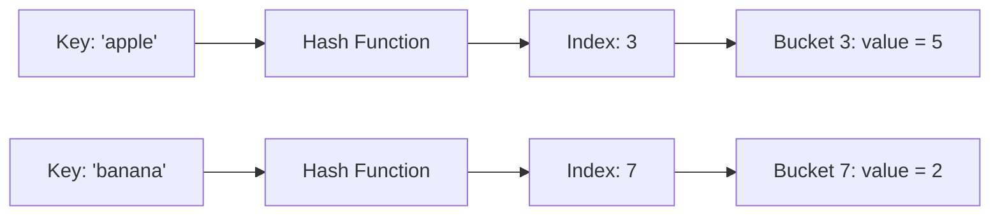

### Hash Collision
When two keys hash to the same index → **chaining** (linked list at that bucket) or **open addressing** (find next empty slot).

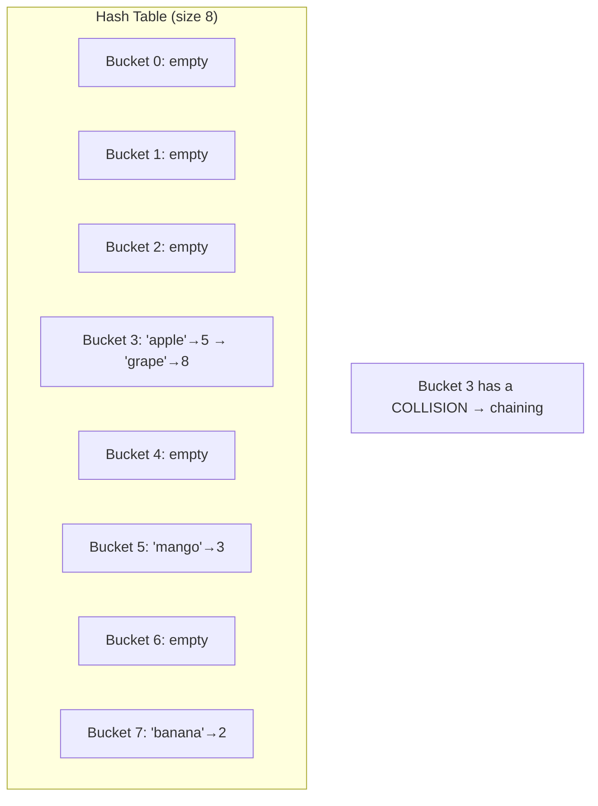

---

## Time Complexity

| Operation | Average | Worst Case              |
| --------- | ------- | ----------------------- |
| Insert    | O(1)    | O(n) — all keys collide |
| Lookup    | O(1)    | O(n)                    |
| Delete    | O(1)    | O(n)                    |
| Space     | O(n)    | O(n)                    |

**Hardware analogy**: HashMap lookup is like **CPU cache hit** — you know exactly where the data lives. Array scanning is like reading from **disk sequentially** — you check every block.

---

## Python `dict` — Essential Methods

```python
# Creating
d = {}                          # empty dict
d = {'a': 1, 'b': 2}          # literal
d = dict(a=1, b=2)            # constructor

# Access
d['a']                          # returns 1, raises KeyError if missing
d.get('a')                      # returns 1, returns None if missing
d.get('z', 0)                   # returns 0 if 'z' not found (SAFE!)

# Insert/Update
d['c'] = 3                      # adds new key or overwrites existing
d.setdefault('d', 4)           # sets 'd'→4 ONLY if 'd' doesn't exist

# Delete
del d['a']                      # removes key, raises KeyError if missing
d.pop('a', None)               # removes and returns value, None if missing (SAFE!)

# Iteration
d.keys()                        # all keys
d.values()                      # all values
d.items()                       # all (key, value) tuples

# Check existence
'a' in d                        # True/False — O(1) average!

# Useful patterns
from collections import defaultdict, Counter

# defaultdict: auto-creates default value for missing keys
freq = defaultdict(int)         # missing keys default to 0
freq['hello'] += 1              # no KeyError!

# Counter: counts elements automatically
from collections import Counter
c = Counter([1, 1, 2, 3, 3, 3])  # Counter({3: 3, 1: 2, 2: 1})
c.most_common(2)                   # [(3, 3), (1, 2)]
```

---

## Two Sum — Problem Walkthrough
 me off just watching this.
### Problem
Given a list of numbers and a target, return indices of two numbers that add up to target.

### The Key Insight

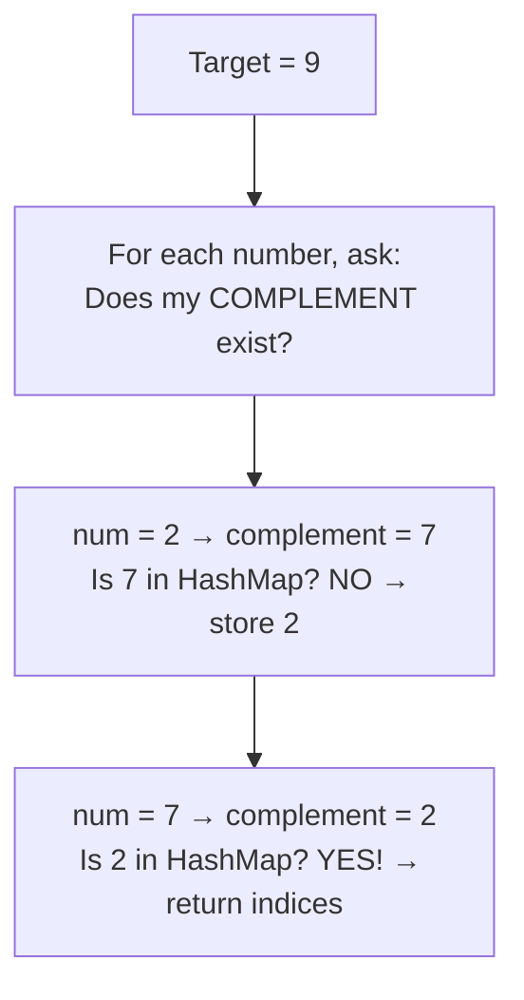

### Dry Run: nums = [2, 7, 11, 15], target = 9

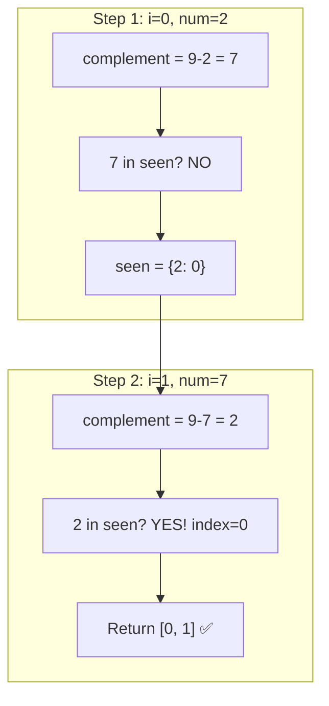

### Approaches Comparison

| Approach | Time | Space | How |
|----------|------|-------|-----|
| Brute Force | O(n²) | O(1) | Check every pair |
| Optimal (HashMap) | O(n) | O(n) | Store seen numbers, check complement |

**Why no "Better" approach?** Sorting would give O(n log n) but DESTROYS original indices. You'd need extra tracking which defeats the purpose. HashMap jumps straight to O(n).

---

## Contains Duplicate — Problem Walkthrough

### Problem
Given an array, return `True` if any value appears at least twice. `False` if all elements are distinct.

### The Key Insight
You don't need a HashMap here — just a **HashSet** (stores only keys, no values). Same O(1) lookup magic.

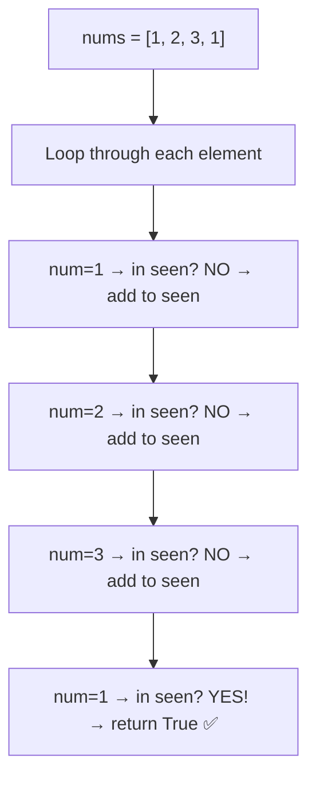

### HashMap vs HashSet — When to Use Which?

| Use Case | Data Structure | Why |
|----------|---------------|-----|
| Need to store key + value (like index) | `dict` (HashMap) | Two Sum — need index |
| Only need to track "have I seen this?" | `set` (HashSet) | Contains Duplicate — just yes/no |
| Need to count frequency | `dict` (HashMap) | Majority Element — count occurrences |
| Need to find common elements | `set` (HashSet) | Intersection — existence across two sets |

### HashSet vs HashMap — Deep Explanation

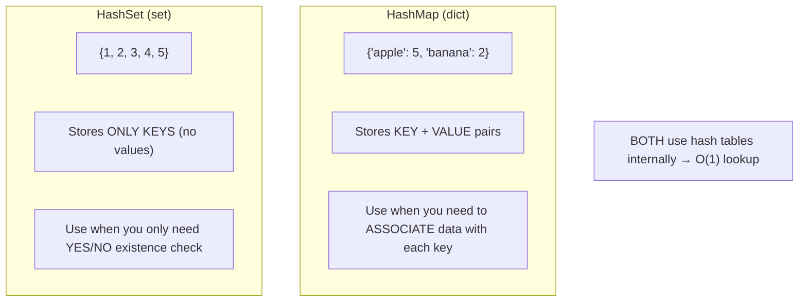

**Think of it this way:**
- **HashMap (dict)** = Phone book → Name (key) → Phone Number (value)
- **HashSet (set)** = Guest list → Name only → "Are they invited? Yes/No"

```python
# HashMap: need to store extra info (index, count, etc.)
seen = {}              # {number: index}
seen[num] = i          # Store WHERE we saw it

# HashSet: just need to know "did I see this before?"
seen = set()           # {number, number, number}
seen.add(num)          # Just mark as seen
num in seen            # Check if exists
```

**Python Set Operations Cheat Sheet:**
```python
a = {1, 2, 3, 4}
b = {3, 4, 5, 6}

a & b    # {3, 4}     — Intersection (in BOTH)
a | b    # {1,2,3,4,5,6} — Union (in EITHER)
a - b    # {1, 2}     — Difference (in a, NOT in b)
a ^ b    # {1, 2, 5, 6} — Symmetric Diff (in one, NOT both)
```

### Approaches

| Approach | Time | Space | How |
|----------|------|-------|-----|
| Brute Force | O(n²) | O(1) | Compare every pair |
| Sorting | O(n log n) | O(1) | Sort → check adjacent elements |
| Optimal (HashSet) | O(n) | O(n) | Track seen elements in set |

**One-liner alternative**: `return len(nums) != len(set(nums))` — but this always builds the FULL set. The loop version returns early on first duplicate (faster in practice).

---

## Valid Anagram — Problem Walkthrough

### Problem
Given two strings `s` and `t`, return `True` if `t` is an anagram of `s`.
Anagram = same characters, same frequency, different order.

### The Key Insight
Anagrams have **identical character frequencies**. Count chars in `s`, un-count chars in `t`. If anything mismatches → not anagram.

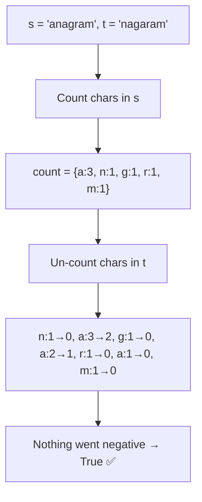

### Why Length Check First?
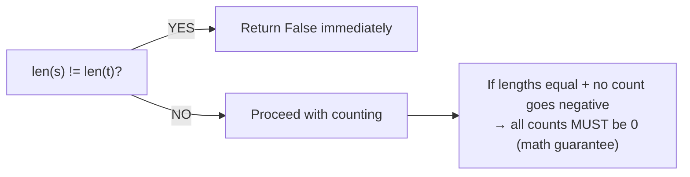

### Approaches

| Approach | Time | Space | How |
|----------|------|-------|-----|
| True Brute | O(n! × n) | O(n!) | Generate all permutations — NEVER do this |
| Better (Sorting) | O(n log n) | O(n) | Sort both, compare |
| Optimal (HashMap) | O(n) | O(1)* | Count frequency | 

*O(1) space because alphabet is fixed (26 lowercase letters max).

### Python One-liner
```python
from collections import Counter
return Counter(s) == Counter(t)
```
Clean for production code, but in interviews show the manual approach first to prove understanding.

---

## Majority Element — Problem Walkthrough

### Problem
Given an array, find the element that appears more than ⌊n/2⌋ times. Guaranteed to exist.

### The Key Insight
This is pure **frequency counting** — the bread and butter of HashMap problems.

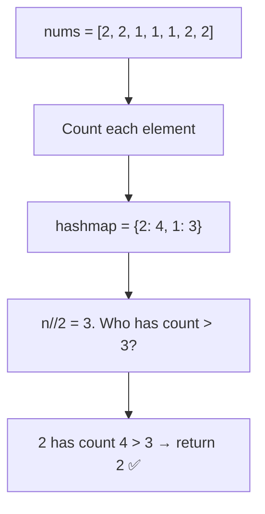

### The .get(key, default) Pattern — MEMORIZE THIS

```python
# This is the CORE counting pattern in Python:
hashmap[num] = hashmap.get(num, 0) + 1

# What it does step by step:
# 1. hashmap.get(num, 0) → "What's num's current count? If not seen, it's 0"
# 2. + 1 → "Increment by 1"
# 3. hashmap[num] = ... → "Store the new count"

# WITHOUT .get() you'd need:
if num in hashmap:
    hashmap[num] += 1
else:
    hashmap[num] = 1
# .get() does the same thing in ONE line. Always use .get()
```

### Early Exit Optimization

```python
# Most people do this (build full map, then search):
for num in nums:
    hashmap[num] = hashmap.get(num, 0) + 1
for key, val in hashmap.items():
    if val > n // 2:
        return key

# YOUR approach (better — exit the MOMENT you find it):
for num in nums:
    hashmap[num] = hashmap.get(num, 0) + 1
    if hashmap[num] > n // 2:  # Check INSIDE the loop!
        return num
```

This is faster in practice because you don't process the whole array.

### Boyer-Moore Voting (O(1) Space Magic)

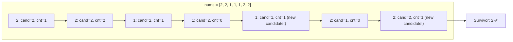

### Approaches

| Approach | Time | Space | How |
|----------|------|-------|-----|
| Brute | O(n²) | O(1) | Count each element manually |
| Optimal (HashMap) | O(n) | O(n) | Frequency map + early exit |
| Boyer-Moore | O(n) | O(1) | Cancel votes — last standing wins |

---

## Intersection of Two Arrays — Problem Walkthrough

### Problem
Given two arrays, return their intersection (common elements, unique only).

### The Key Insight
Convert one array to a **HashSet** → O(1) lookups. Then check each element of the other array against it.

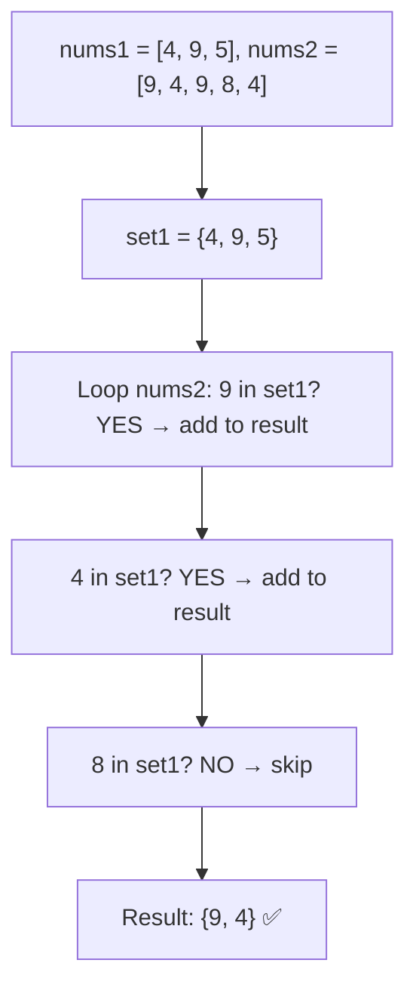

### Three Levels

| Approach | Time | Space | How |
|----------|------|-------|-----|
| Brute | O(n × m) | O(min(n,m)) | Nested loops |
| Better (Manual) | O(n + m) | O(n) | Build set, loop + check |
| Optimal (Pythonic) | O(n + m) | O(n + m) | `set(a) & set(b)` one-liner |

### The One-Liner
```python
return list(set(nums1) & set(nums2))
```
`&` on sets = intersection. Know this for interviews — it's clean and correct.

---

## Pattern Recognition 🧠

The **"complement lookup"** pattern appears in MANY problems:
- Two Sum → complement = target - num
- Two Sum II (sorted array) → two pointers instead
- 3Sum → fix one, two-pointer on rest
- 4Sum → fix two, two-pointer on rest
- Subarray Sum Equals K → prefix sum + HashMap

**Interview tip**: Whenever you hear "find a pair that satisfies condition" → think HashMap first.

---

## Sathwik's Learnings (Jul 29 - Aug 4, 2026)

- First problem back after a break — used Copilot to understand, then traced through it
- Already solved this in C++ before — Python version is cleaner and shorter
- Key realization: `enumerate()` replaces the manual `for i in range(len())` pattern
- The `in` operator on dict is O(1) — this is the power of HashMap
- **Contains Duplicate**: Realized that `set` is just a HashMap without values — same O(1) lookup
- Wrote solid test cases (empty, single, negatives, large arrays) — good interview habit
- Two problems in one morning after weeks of zero → consistency restart
- **Valid Anagram (Jul 30)**: Used `.get(ch, 0)` from HashMap notes — pattern is sticking!
- Recognized that len check + no negatives = guaranteed all-zero (mathematical proof, not just hope)
- Old solution had a bug (`else: return True`) — new version is cleaner with class structure
- **Majority Element (Aug 3)**: KNEW what to do without looking! Pattern recognition is working.
- Only forgot the `.get(num, 0) + 1` syntax — but knew the CONCEPT. That's progress.
- Added early exit optimization (check inside loop, not after) — smart instinct
- **Intersection of Two Arrays (Aug 4)**: Used set `&` operator for one-liner. Clean.
- Understood the difference: dict for key+value, set for existence-only checks

---

## Fun Fact 🎉

Two Sum is LeetCode Problem #1 — literally the FIRST problem ever added to LeetCode. It's been solved over 15 million times. If you can solve Two Sum optimally, you understand the fundamental HashMap pattern that appears in ~30% of all interview problems.

---

## Common Mistakes to Avoid

1. **Using same element twice**: `j` must start from `i+1` in brute force (your code had `range(len(nums))` for j — should be `range(i+1, len(nums))`)
2. **Storing before checking**: Always CHECK if complement exists FIRST, then store current number. Otherwise you might match a number with itself.
3. **Returning values instead of indices**: Problem asks for INDICES, not the numbers themselves.
