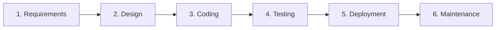
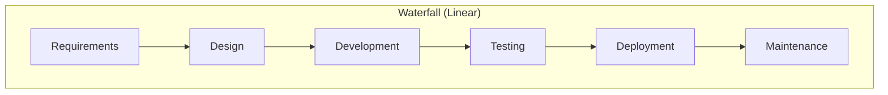
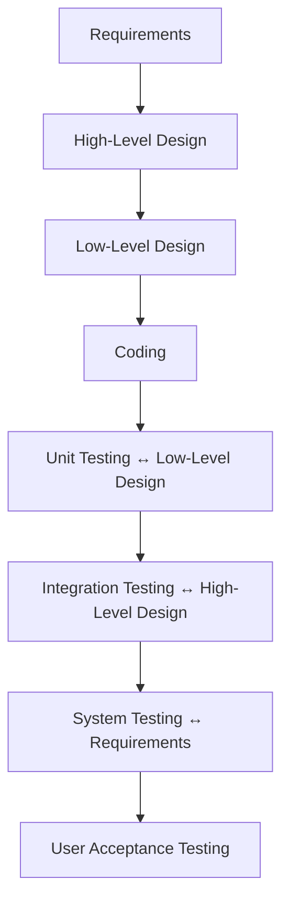
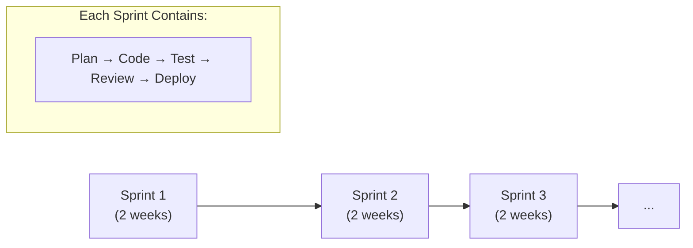
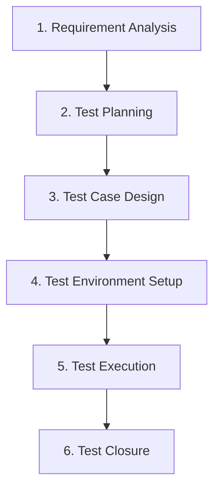
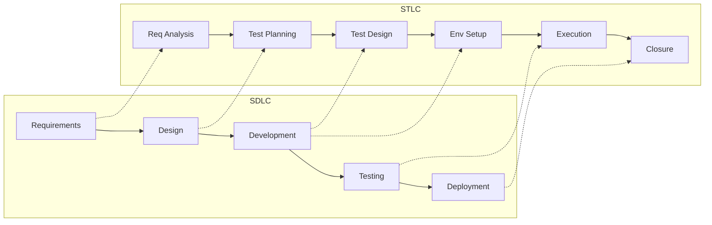

# SDET Theory — Week 1: SDLC & STLC

## The Big Picture — Where Everything Sits

```
Software Engineering Methodologies
│
├── SDLC (Software Development Life Cycle) ← The WHAT & overall process
│   └── STLC (Software Testing Life Cycle) ← A subset that runs within SDLC
│
└── Process Models (HOW you execute the SDLC)
    ├── Waterfall (linear, sequential)
    ├── V-Model (parallel testing)
    ├── Agile (mindset/philosophy)
    │   ├── Scrum (framework — sprints, ceremonies)
    │   └── Kanban (method — flow, WIP limits)
    └── Others (Spiral, RAD, etc.)
```

**Key insight**: SDLC defines WHAT phases exist. Process Models define HOW you execute them.

---

## SDLC (Software Development Life Cycle)

### What is it?
SDLC is the **end-to-end process** for building software. Regardless of which model you follow, every SDLC has these phases:

**Interview answer**: "SDLC defines the phases involved in developing software, from gathering requirements to deployment and maintenance."

### The 6 Phases

| # | Phase | What Happens |
|---|-------|-------------|
| 1 | **Requirement Gathering & Analysis** | Understand what to build (BRD, SRS documents) |
| 2 | **System Design** | Architecture, HLD (High-Level Design), LLD (Low-Level Design) |
| 3 | **Implementation / Coding** | Actual development |
| 4 | **Testing** | Verify & validate (this is where STLC lives) |
| 5 | **Deployment** | Release to production/customers |
| 6 | **Maintenance** | Bug fixes, updates, enhancements |



---

## Process Models — The "HOW"

### SDLC Models Comparison

| Aspect | Waterfall | V-Model | Scrum | Kanban |
|--------|-----------|---------|-------|--------|
| Approach | Sequential | Sequential + parallel test planning | Iterative, time-boxed | Continuous flow |
| Flexibility | Rigid | Rigid | Adaptive | Highly adaptive |
| Testing starts | After coding | Planned from requirements | Within each sprint | Continuous |
| Delivery | End of project | End of project | Every sprint | Continuous |
| Best for | Fixed scope | Critical systems | Evolving products | Maintenance/ops |

---

### SDLC Models



#### 1. Waterfall Model
- **Type**: Linear, sequential
- **Flow**: Requirements → Design → Code → Test → Deploy (one way, no going back)
- **Key trait**: Each phase completes fully before the next begins. No going back.
- **When to use**: Fixed requirements, well-understood projects. Government, banking.
- **Downside**: Late testing, costly changes. Bug found in testing? Going back to design is expensive.
- **QA role**: Testing happens ONLY after development is complete. Late feedback.

#### 2. V-Model (Verification & Validation)
- **Type**: Extension of Waterfall
- **Flow**: Each development phase has a **corresponding testing phase** planned in parallel
- **Key trait**: Testing is planned from day one, not an afterthought
- **When to use**: Safety-critical systems (medical devices, aerospace, hardware-software projects)

```
Requirements       ←→  Acceptance Testing
  System Design    ←→  System Testing
    Module Design  ←→  Integration Testing
      Coding       ←→  Unit Testing
```



#### 3. Agile (Philosophy/Mindset)
- **Type**: Iterative & incremental
- **Key traits**: Working software over documentation. Respond to change over following a plan.
- **Important**: Agile is NOT a process — it's a set of values (Agile Manifesto). Scrum and Kanban are IMPLEMENTATIONS of Agile.
- **QA role**: Testing happens WITHIN each sprint. QA is embedded in the team.



#### 4. Scrum (Framework under Agile)
- **Type**: Time-boxed iterative framework
- **Roles**: Product Owner (what to build), Scrum Master (remove blockers), Dev Team (build it)
- **Structure**:

```
Product Backlog
  → Sprint Planning
    → Sprint (2-4 weeks)
      → Daily Standup (15 min)
      → Development + Testing (parallel)
    → Sprint Review (demo to stakeholders)
    → Sprint Retrospective (what went well, what didn't)
  → Repeat
```

- **Artifacts**: Product Backlog, Sprint Backlog, Increment
- **Key trait**: Fixed time-box, cross-functional team, delivers potentially shippable increment each sprint

#### 5. Kanban (Method under Agile)
- **Type**: Continuous flow, no time-boxes
- **Structure**:

```
Backlog → In Progress → Review → Testing → Done
         (WIP Limits enforced at each column)
```

- **Key traits**: Visualize workflow (board), Limit Work-In-Progress (WIP), continuous delivery — no sprints, just flow
- **When to use**: Support/maintenance teams, ops, where work is unpredictable

---

### Summary Hierarchy

```
Methodologies
 └── SDLC (defines WHAT phases)
      └── STLC (subset: testing phases within SDLC)

Models (define HOW you execute SDLC):
 ├── Traditional: Waterfall → V-Model
 └── Agile (philosophy)
      ├── Scrum (sprints, ceremonies, roles)
      └── Kanban (flow, WIP limits, board)
```

**Interview tip**: "In my current role, we follow Agile/Scrum methodology. We work in 2-week sprints, and as a QA I'm involved from sprint planning through to testing and deployment."

---

## STLC (Software Testing Life Cycle)

### What is it?
STLC is the **testing-specific** process within SDLC. It's what QA does from start to finish.

**Interview answer**: "STLC defines the steps in testing — from understanding requirements to test closure. It runs parallel to SDLC."

---

### STLC Phases



#### 1. Requirement Analysis
- **What**: Understand WHAT to test. Read requirements, ask questions, identify testable items.
- **Output**: RTM (Requirement Traceability Matrix) — maps requirements to test cases.
- **QA asks**: "Is this requirement testable? What are the acceptance criteria?"

#### 2. Test Planning
- **What**: HOW to test. Define scope, approach, resources, timeline, tools.
- **Output**: Test Plan document.
- **Includes**: What to test, what NOT to test, entry/exit criteria, risk assessment.
- **Your current job**: You probably have sprint-level test plans.

#### 3. Test Case Design
- **What**: WRITE the actual test cases. Positive, negative, boundary, edge cases.
- **Output**: Test cases, test scripts (automation).
- **Techniques**: BVA, Equivalence Partitioning, Decision Table (covered in Week 6).

#### 4. Test Environment Setup
- **What**: Prepare the testing infrastructure. Browsers, devices, test data, tools.
- **Output**: Ready-to-test environment.
- **Your context**: Setting up Playwright, configuring browsers, test data setup.

#### 5. Test Execution
- **What**: RUN the tests. Log results. Report bugs.
- **Output**: Test results, bug reports, defect logs.
- **Key**: Execute, compare actual vs expected, log defects with steps to reproduce.

#### 6. Test Closure
- **What**: Wrap up. Metrics, lessons learned, sign-off.
- **Output**: Test summary report, metrics (pass/fail ratio, defect density).
- **Metrics**: Total TCs executed, pass %, defects found, severity breakdown.

---

### Entry & Exit Criteria

| Phase | Entry Criteria (Start when...) | Exit Criteria (Done when...) |
|-------|-------------------------------|------------------------------|
| Test Planning | Requirements are approved | Test plan signed off |
| Test Design | Test plan approved | All test cases reviewed |
| Test Execution | Environment ready, build deployed | All TCs executed, critical bugs fixed |
| Test Closure | All testing complete | Test summary report approved |

**Interview question**: "What are entry and exit criteria?"
**Answer**: "Entry criteria define when to START a phase (prerequisites met). Exit criteria define when to END a phase (deliverables complete). For example, test execution can't start until the build is deployed and environment is ready."

---

## How SDLC and STLC Connect



STLC runs **parallel** to SDLC, not after it. In Agile, both happen within the same sprint.

---

## Quick Interview Q&A

**Q: What's the difference between SDLC and STLC?**
A: SDLC is the entire software development process. STLC is specifically the testing process within SDLC.

**Q: Which SDLC model do you follow?**
A: "We follow Agile with 2-week sprints. QA is involved from sprint planning — we write test cases during development and execute them before sprint end."

**Q: What happens if requirements change mid-sprint?**
A: "In Agile, we can accommodate changes in the NEXT sprint. Current sprint scope is generally locked. If it's critical, we negotiate with the Product Owner."

**Q: When does testing start in Agile?**
A: "Testing starts from Day 1 — we review requirements, write test cases during development, and execute the moment a feature is ready. We don't wait for all development to finish."

---

## Sathwik's Connection to This

You're already LIVING this at work:
- You work in sprints (Agile/Scrum)
- You write and execute test cases (STLC phases 3-5)
- You raise bugs (7 in one day! That's test execution phase)
- You use Playwright (test environment + execution)
- You do regression testing (re-running existing tests after changes)

The difference between what you DO and what interviews ASK is just the VOCABULARY. You already do this stuff — now you know what it's called.
