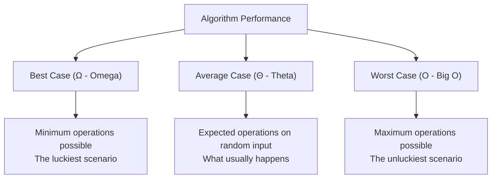
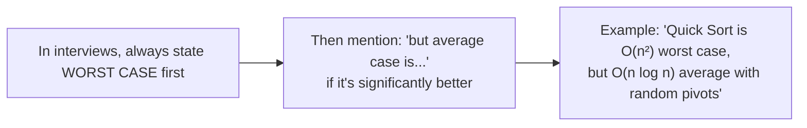
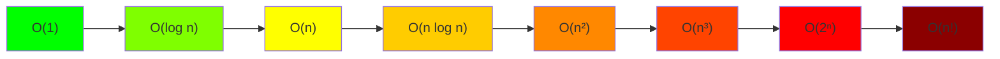
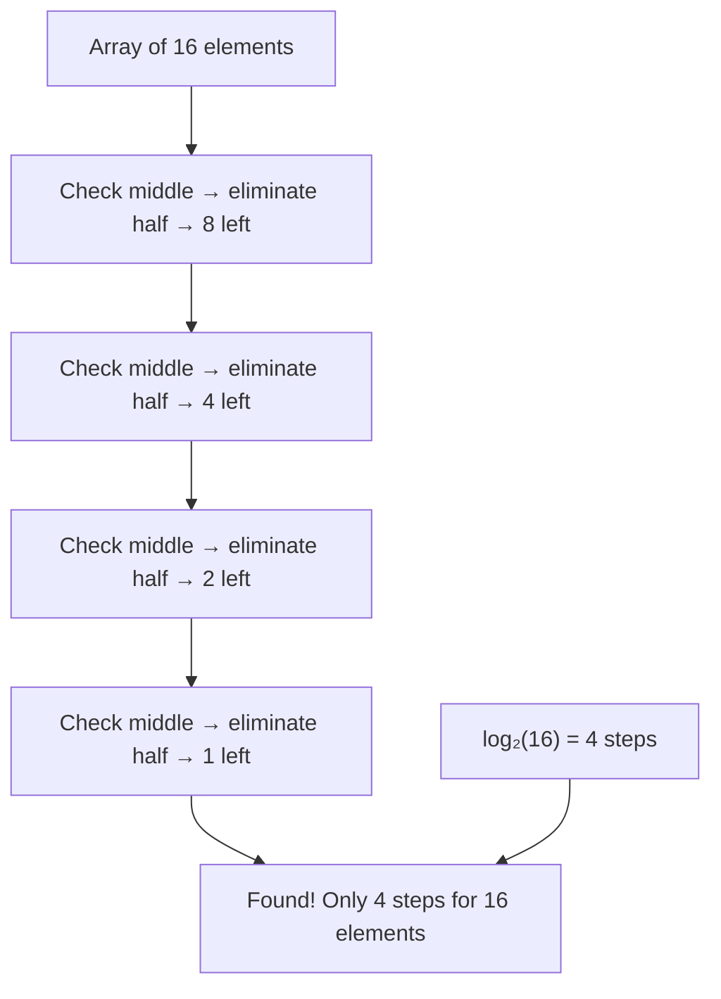
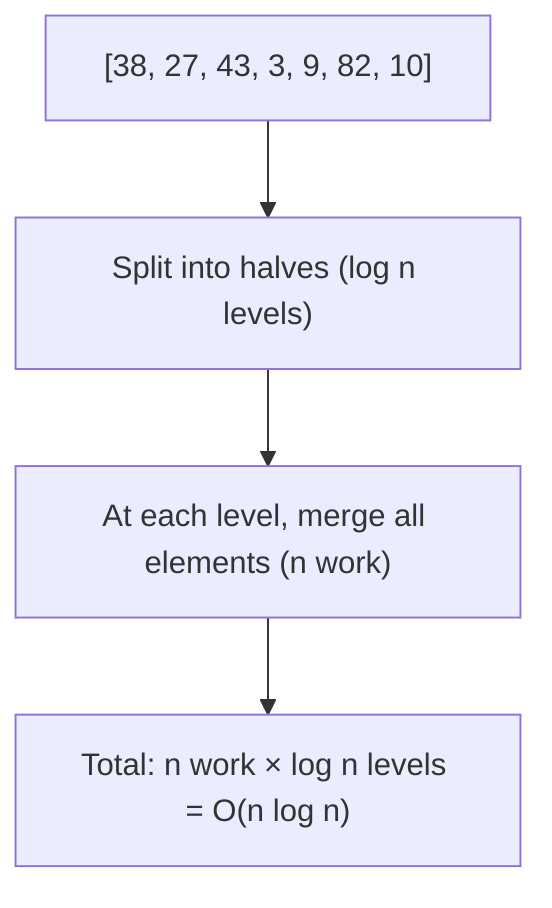
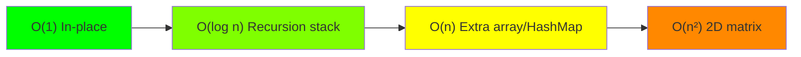
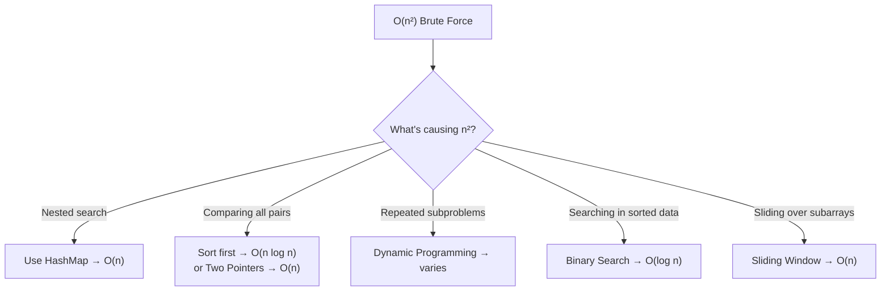
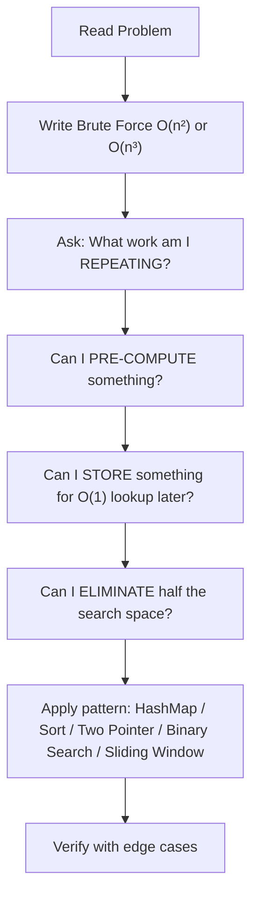
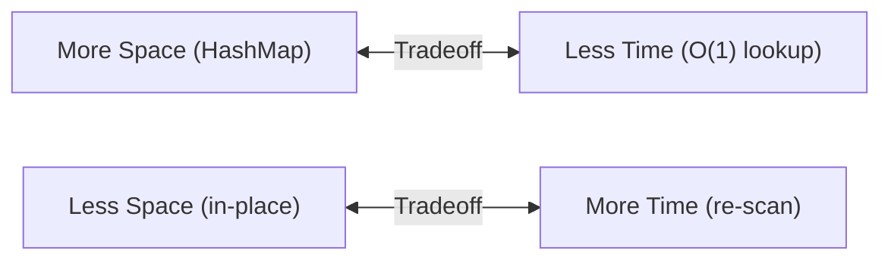
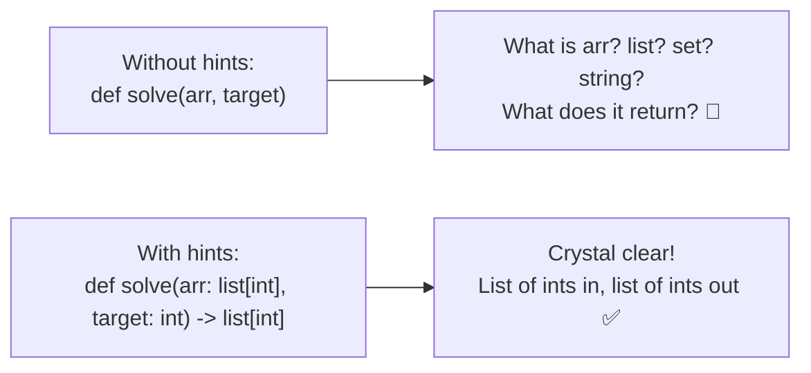

# Time & Space Complexity — The Complete Guide

## What IS Complexity?

Complexity answers one question: **How does the performance of your code SCALE as input grows?**

It's NOT about "how fast" your code runs on YOUR machine. It's about the **growth pattern**.

**Real-world analogy:**
- O(1): Finding your phone in your pocket — doesn't matter if you have 1 item or 100, you know exactly where it is.
- O(n): Finding a specific shirt in an unsorted pile — more clothes = more time searching.
- O(n²): Comparing every shirt with every other shirt to find matching pairs — pile doubles, work QUADRUPLES.

---

## Best, Worst & Average Case Complexity

Every algorithm can behave DIFFERENTLY depending on the INPUT it receives. That's why we have three cases:

### The Three Cases



### Real-World Analogy

Imagine searching for your friend in a crowd of 100 people:
- **Best case**: They're the FIRST person you see → 1 look
- **Average case**: You find them roughly halfway → ~50 looks
- **Worst case**: They're the LAST person, or not even there → 100 looks

### Example: Linear Search

```python
def linear_search(arr, target):
    for i in range(len(arr)):
        if arr[i] == target:
            return i
    return -1
```

| Case | When It Happens | Complexity | Example |
|------|----------------|------------|---------|
| **Best** | Target is at index 0 | O(1) | `arr = [5, 3, 8]`, target = 5 |
| **Average** | Target is somewhere in middle | O(n/2) = O(n) | target randomly placed |
| **Worst** | Target is last OR not present | O(n) | target = 8 (last) or target = 99 (not found) |

### Example: Bubble Sort

| Case | When It Happens | Complexity |
|------|----------------|------------|
| **Best** | Array is ALREADY sorted | O(n) — just one pass, no swaps |
| **Average** | Random order | O(n²) |
| **Worst** | Array is REVERSE sorted | O(n²) — maximum swaps needed |

### Example: Quick Sort

| Case | When It Happens | Complexity |
|------|----------------|------------|
| **Best** | Pivot always splits array in half | O(n log n) |
| **Average** | Random pivots | O(n log n) |
| **Worst** | Pivot is always smallest/largest (sorted input + bad pivot) | O(n²) |

This is why **Merge Sort is preferred over Quick Sort** when you need guaranteed O(n log n) — it has the same complexity in ALL cases.

### The Notations

| Symbol | Name | Meaning | Used For |
|--------|------|---------|----------|
| **O** (Big O) | Upper bound | "At MOST this many operations" | Worst case (most commonly used) |
| **Ω** (Omega) | Lower bound | "At LEAST this many operations" | Best case |
| **Θ** (Theta) | Tight bound | "EXACTLY this growth rate" | Average case (when best = worst) |

### Which One Matters Most?

**Big O (Worst Case)** — this is what interviews care about 99% of the time.

Why? Because:
- You can't control what input your code receives
- Systems must handle the WORST scenario gracefully
- If your worst case is O(n²) on a million elements, your server crashes

**When to mention Best Case in interviews:**
- When asked directly: "What's the best case for this?"
- When comparing algorithms: "Quick sort's worst case is O(n²) but average is O(n log n)"
- Bubble sort's best case O(n) on nearly-sorted data — sometimes useful

### Common Algorithms — All Three Cases

| Algorithm | Best | Average | Worst | Space |
|-----------|------|---------|-------|-------|
| Linear Search | O(1) | O(n) | O(n) | O(1) |
| Binary Search | O(1) | O(log n) | O(log n) | O(1) |
| Bubble Sort | O(n) | O(n²) | O(n²) | O(1) |
| Selection Sort | O(n²) | O(n²) | O(n²) | O(1) |
| Insertion Sort | O(n) | O(n²) | O(n²) | O(1) |
| Merge Sort | O(n log n) | O(n log n) | O(n log n) | O(n) |
| Quick Sort | O(n log n) | O(n log n) | O(n²) | O(log n) |
| HashMap Lookup | O(1) | O(1) | O(n)* | O(n) |

*HashMap worst case O(n) happens when ALL keys hash to same bucket (collision). In practice, almost never happens with good hash functions.

### Key Takeaway



---

## Time Complexity (CPU Work)

Time complexity = **how many operations** your code performs as input size `n` grows.

### The Hierarchy (FASTEST → SLOWEST)



### How Each One Feels with n = 1,000,000 (1 million)

| Complexity | Operations | Time (approx) | Analogy |
|-----------|-----------|---------------|---------|
| O(1) | 1 | Instant | Opening your fridge |
| O(log n) | 20 | Instant | Binary search in a dictionary |
| O(n) | 1,000,000 | ~1 second | Reading a book page by page |
| O(n log n) | 20,000,000 | ~2-3 seconds | Merge sort |
| O(n²) | 1,000,000,000,000 | ~11 days | Comparing every person with every other person in a city |
| O(n³) | 10¹⁸ | ~31,000 years | Triple nested loops — useless |
| O(2ⁿ) | 2¹⁰⁰⁰⁰⁰⁰ | Heat death of universe | Brute force all subsets |
| O(n!) | Infinity basically | Never | Brute force all permutations |

---

## Understanding Each Complexity

### O(1) — Constant Time
**Operations don't change with input size.**

```python
def get_first(arr):
    return arr[0]  # Always 1 operation, whether arr has 5 or 5 million elements

def hash_lookup(d, key):
    return d.get(key)  # dict lookup is O(1) average — hash magic
```

**Examples:** Array index access, HashMap lookup, push/pop on stack, arithmetic operations.

---
 
### O(log n) — Logarithmic Time
**Input HALVES each step.** If n = 1,000,000, only ~20 steps needed.

```python
def binary_search(arr, target):
    lo, hi = 0, len(arr) - 1
    while lo <= hi:
        mid = (lo + hi) // 2
        if arr[mid] == target:
            return mid
        elif arr[mid] < target:
            lo = mid + 1  # Eliminate LEFT half
        else:
            hi = mid - 1  # Eliminate RIGHT half
    return -1
```



**Key insight:** Every time you see "divide in half each step" → it's O(log n).

**Examples:** Binary search, balanced BST operations, finding in sorted data.

---

### O(n) — Linear Time
**Visit each element ONCE.**

```python
def find_max(arr):
    max_val = arr[0]
    for num in arr:      # One pass through array
        if num > max_val:
            max_val = num
    return max_val

def two_sum(nums, target):
    seen = {}
    for i, num in enumerate(nums):  # One pass + O(1) HashMap lookups
        complement = target - num
        if complement in seen:
            return [seen[complement], i]
        seen[num] = i
```

**Examples:** Linear search, single for-loop, HashMap-based solutions, counting.

---

### O(n log n) — Linearithmic Time
**Usually means: sorting, or divide-and-conquer.**

```python
def merge_sort(arr):
    if len(arr) <= 1:
        return arr
    mid = len(arr) // 2
    left = merge_sort(arr[:mid])    # Divide
    right = merge_sort(arr[mid:])   # Divide
    return merge(left, right)       # Conquer (merge is O(n))
```



**Why O(n log n)?** You split the array log(n) times (that's the tree depth), and at each level you do O(n) total work merging.

**Examples:** Merge sort, quick sort (avg), heap sort, `sorted()` in Python.

---

### O(n²) — Quadratic Time
**Nested loops — each element compared with every other.**

```python
def bubble_sort(arr):
    n = len(arr)
    for i in range(n):          # n times
        for j in range(n - 1):  # × n times = n²
            if arr[j] > arr[j+1]:
                arr[j], arr[j+1] = arr[j+1], arr[j]

def brute_two_sum(nums, target):
    for i in range(len(nums)):        # n
        for j in range(i+1, len(nums)):  # × n = n²
            if nums[i] + nums[j] == target:
                return [i, j]
```

**Rule of thumb:** See 2 nested loops over input → likely O(n²).

**Examples:** Bubble sort, selection sort, brute force pair-finding.

---

### O(2ⁿ) — Exponential Time
**Each element has 2 choices (include/exclude). All subsets explored.**

```python
def all_subsets(nums, i=0, current=[]):
    if i == len(nums):
        print(current)
        return
    # Choice 1: include nums[i]
    all_subsets(nums, i+1, current + [nums[i]])
    # Choice 2: exclude nums[i]
    all_subsets(nums, i+1, current)
```

**Examples:** Recursive subsets, some backtracking problems without pruning.

---

### O(n!) — Factorial Time
**All permutations. NEVER acceptable in interviews.**

```python
def all_permutations(nums):
    if len(nums) <= 1:
        return [nums]
    result = []
    for i in range(len(nums)):
        rest = nums[:i] + nums[i+1:]
        for perm in all_permutations(rest):
            result.append([nums[i]] + perm)
    return result
```

**Examples:** Brute force TSP, generating all arrangements.

---

## Space Complexity (RAM Usage)

Space complexity = **how much EXTRA memory** your code uses as input grows.

**Important:** The INPUT itself doesn't count. Only EXTRA space you create.

### Space Hierarchy



### Examples

| Space | What It Means | Example |
|-------|--------------|---------|
| O(1) | Only a few variables, no matter input size | Two pointers, swapping in-place |
| O(log n) | Recursion depth (e.g., binary search recursive) | Binary search, balanced tree traversal |
| O(n) | Created a new array/dict of same size as input | HashMap, copied array, recursion on full array |
| O(n²) | 2D matrix | DP table, adjacency matrix |

```python
# O(1) space — only variables, no extra structures
def reverse_in_place(arr):
    left, right = 0, len(arr) - 1
    while left < right:
        arr[left], arr[right] = arr[right], arr[left]
        left += 1
        right -= 1

# O(n) space — created a HashMap
def two_sum(nums, target):
    seen = {}  # This grows up to n entries
    for i, num in enumerate(nums):
        complement = target - num
        if complement in seen:
            return [seen[complement], i]
        seen[num] = i
```

---

## How to Calculate Complexity — The Rules

### Rule 1: Drop Constants
O(2n) → O(n). O(100n) → O(n). Constants don't matter at scale.

### Rule 2: Drop Lower Terms
O(n² + n) → O(n²). The biggest term dominates.

### Rule 3: Loops
```python
for i in range(n):          # O(n)
    for j in range(n):      # × O(n) = O(n²)
        for k in range(n):  # × O(n) = O(n³)
```

### Rule 4: Sequential = Add, Nested = Multiply
```python
# Sequential: O(n) + O(n) = O(2n) = O(n)
for i in range(n):
    print(i)
for j in range(n):
    print(j)

# Nested: O(n) × O(n) = O(n²)
for i in range(n):
    for j in range(n):
        print(i, j)
```

### Rule 5: Different Inputs = Different Variables
```python
# This is O(a × b), NOT O(n²)
def compare(arr1, arr2):
    for x in arr1:      # O(a)
        for y in arr2:  # × O(b)
            if x == y:
                return True
```

---

## Optimization Tips — How to Go from Brute to Optimal



### Common Optimization Patterns

| Brute Force Pattern | Optimization | New Complexity |
|-------------------|--------------|----------------|
| Nested loop finding pair | HashMap (store + lookup) | O(n²) → O(n) |
| Nested loop on sorted array | Two Pointers | O(n²) → O(n) |
| Checking all subarrays | Sliding Window | O(n²) → O(n) |
| Linear search in sorted data | Binary Search | O(n) → O(log n) |
| Recomputing from scratch | Prefix Sum / DP | O(n²) → O(n) |
| Sorting for every query | Sort once + Binary Search | O(n² log n) → O(n log n) |

### The Interview Thought Process



---

## LeetCode Constraints Cheat Sheet

**Use this to GUESS the expected complexity from constraints:**

| Constraint (n ≤) | Expected Time Complexity | Why |
|------------------|------------------------|-----|
| n ≤ 10 | O(n!) or O(2ⁿ) | Backtracking, brute force OK |
| n ≤ 20 | O(2ⁿ) | Bitmask DP, subsets |
| n ≤ 500 | O(n³) | Triple loops OK |
| n ≤ 5,000 | O(n²) | Double loops OK |
| n ≤ 100,000 | O(n log n) | Sorting, binary search |
| n ≤ 1,000,000 | O(n) | Single pass, HashMap |
| n ≤ 10⁹ | O(log n) or O(1) | Math, binary search on answer |

**This is GOLD for interviews.** If constraints say n ≤ 10⁵, your brute O(n²) will TLE. You NEED O(n log n) or O(n).

---

## Space-Time Tradeoff

The most important concept in optimization:

> **You can almost always trade SPACE for TIME.**



| Example | Time | Space | Tradeoff |
|---------|------|-------|----------|
| Two Sum brute | O(n²) | O(1) | No extra memory, but slow |
| Two Sum optimal | O(n) | O(n) | Uses HashMap memory, but fast |
| Contains Dup (sort in-place) | O(n log n) | O(1) | Slower but no extra space |
| Contains Dup (HashSet) | O(n) | O(n) | Faster but uses memory |

**Interview tip:** Always mention the tradeoff. "I'm trading O(n) space to get O(n) time instead of O(n²)." Interviewers LOVE hearing this.

---

## Python Type Hints (Type Annotations)

### What Are They?

Type hints (also called **type annotations**) tell Python what TYPE of data a function expects and returns. They're like a contract — "I expect strings in, I'll give a bool out."

```python
def optimal(self, s: str, t: str) -> bool:
#                    ^^^^   ^^^^    ^^^^^^
#                    |      |       |
#              param 's'   param 't'   return type
#              is a str    is a str    is a bool
```

### Syntax

```python
# Basic types
def add(a: int, b: int) -> int:
    return a + b

# Collections
def find_max(nums: list[int]) -> int:
    return max(nums)

# Optional (can be None)
from typing import Optional
def search(arr: list[int], target: int) -> Optional[int]:
    # Returns index or None
    pass

# Multiple return types
def two_sum(nums: list[int], target: int) -> list[int]:
    pass
```

### Important Facts

| Fact | Explanation |
|------|-------------|
| **NOT enforced at runtime** | Python ignores them while running. `def add(a: int)` — you can still pass a string. No error. |
| **For humans and tools** | IDEs (VS Code, PyCharm) use them for autocomplete and error detection |
| **mypy** | A tool that checks type correctness BEFORE running. Like a spell-checker for types. |
| **Interview signal** | Using type hints shows you write professional, readable code |

### Common Type Hints

```python
# Primitives
x: int = 5
y: float = 3.14
name: str = "Sathwik"
flag: bool = True

# Collections (Python 3.9+)
nums: list[int] = [1, 2, 3]
pairs: list[tuple[int, int]] = [(1, 2), (3, 4)]
freq: dict[str, int] = {"a": 1, "b": 2}
unique: set[int] = {1, 2, 3}

# Function with type hints
def brute(self, nums: list[int], target: int) -> list[int]:
    pass

# None return
def print_hello() -> None:
    print("hello")
```

### The `->` Arrow

```python
def function_name(param: type) -> return_type:
```

- `->` is called the **return type annotation**
- It tells readers what TYPE the function gives back
- `-> bool` = returns True/False
- `-> list[int]` = returns a list of integers
- `-> None` = returns nothing (like void in C++)

### Why Use Them in DSA Practice?

1. **Readability**: Anyone reading your code instantly knows input/output types
2. **IDE help**: VS Code gives better autocomplete and catches bugs
3. **Interview**: Shows professionalism — separates juniors from mid-level engineers
4. **Self-documentation**: No need for comments like "# arr is a list of integers"


